# Educ Bénin — Spécification de design

> **Document de référence de design, faisant foi.** Il est construit à partir de l'audit intégral du fichier prototype `educbenin-prototype.html` (1592 lignes, HTML+CSS+JS dans un seul fichier, testé exhaustivement — voir `README.md` à la racine de ce dossier). Toutes les valeurs (couleurs, tailles, espacements, textes) sont recopiées **telles quelles** depuis le code source — aucune valeur n'est approximée ni inventée. Les rares points encore ouverts côté produit (règles de validation non définies, contenus juridiques à compléter, etc.) sont signalés explicitement dans la section « Récapitulatif des points à trancher » à la fin de chaque écran concerné, et ne doivent pas être comblés par extrapolation.
>
> Rappel de contexte important : ce prototype est un **outil de design simulé**, pas un site responsive réel. Le rail de gauche liste les 15 écrans (tous coexistent dans le DOM, cachés par `display:none` sauf `.screen.active`). Le bouton Bureau/Mobile de la barre d'outils (`#deviceSeg`) ajoute une classe `.mobile` à `#frame`, qui borne sa largeur à 390px et déclenche des règles CSS à l'intérieur d'une **container query** `@container frame (max-width:760px)` — c'est cette container query qui contient toutes les règles "mobile" du produit réel. Il existe une **deuxième** media query, `@media (max-width:860px)`, qui ne concerne que le chrome de l'outil de prototypage lui-même (rail devient horizontal, etc.) — à ne pas confondre avec la précédente, et à ignorer pour la reconstruction du produit réel.

---

## Fondations de design (lire avant les 15 écrans)

### Tokens de couleur (`:root`, valeurs exactes)
| Rôle | Variable | Valeur |
|---|---|---|
| Texte principal | `--prod-ink` | `#1E1B33` |
| Texte atténué | `--prod-ink-muted` | `#655F80` |
| Texte très atténué | `--prod-ink-faint` | `#9490AC` |
| Surface (cartes, cadre) | `--prod-surface` | `#FFFFFF` |
| Surface secondaire (fonds de section, inputs désactivés) | `--prod-surface-2` | `#F7F6FC` |
| Fond de page (back-office `.bo-main`) | `--prod-page` | `#FBFAFE` |
| Bordure | `--prod-border` | `#E4E1F0` |
| Primaire (indigo) | `--prod-primary` | `#4F46E5` |
| Primaire foncé | `--prod-primary-dark` | `#3730A3` |
| Teinte primaire (fonds clairs) | `--prod-primary-tint` | `#EEF0FE` |
| Or (réservé aux moments officiels/authentification) | `--prod-gold` | `#9C6F17` |
| Teinte or | `--prod-gold-tint` | `#F6EEDA` |
| Succès | `--prod-success` | `#0E9F6E` |
| Teinte succès | `--prod-success-tint` | `#D8F6EA` |
| Avertissement | `--prod-warning` | `#B45309` |
| Teinte avertissement | `--prod-warning-tint` | `#FDF0DA` |
| Danger | `--prod-danger` | `#C0362C` |
| Teinte danger | `--prod-danger-tint` | `#FBE7E5` |

L'or n'est utilisé **que** pour : l'eyebrow des sections (`.eyebrow`), le badge d'année sur la fiche spécialité (`.badge-year`), le liseré + puces numérotées du bloc "Pièces à fournir" (`.doc-card`), le libellé `.page-head .k` / `.legal .k` ("Accompagnement", "Suivi", "Légal"...), et l'eyebrow du panneau de connexion back-office (variante plus claire `#F4D98A` sur fond indigo foncé). C'est un principe de design déclaré : réserver l'or aux moments "officiels" (authentification, pièces officielles, année scolaire).

### Typographie
- Corps de texte / UI : **IBM Plex Sans** (400/500/600/700), chargée via Google Fonts.
- Titres `h1`–`h4` : **Source Serif 4** (serif), avec `text-wrap:balance`. Tous les titres du produit (hero, sections, page-head, légal, modal) utilisent cette police serif — c'est la signature visuelle du produit.
- Données / références / montants : **IBM Plex Mono**, avec `font-variant-numeric:tabular-nums` (classe utilitaire `.mono`), utilisée pour : références de dossier, montants FCFA, dates/heures des spécialités, table financière, code spécialité (ANR, BCL...).
- Taille de base du texte produit : `15px`, `line-height:1.6` (classe `.prod`).

Échelle de titres observée (valeurs exactes) :
- `.hero h1` : 38px desktop / 26px mobile (container query), `line-height:1.14`, `font-weight:700`, `letter-spacing:-.01em`.
- `.section h2` : 23px desktop / 19px mobile.
- `.page-head h1` : 27px desktop / 21px mobile.
- `.legal h1` : 25px (pas de variante mobile dédiée).
- `.legal h2` (intertitres d'article) : 16.5px.
- `.modal-head h3` : 17px. `.bo-h1` : 17px.
- `.spec-detail h3` (fiche spécialité) : 19px.
- `.doc-card h3` inline : 16px.

### Rayons de bordure (échelle observée)
- Petits éléments (chips de piste `.track-pick button`, boutons `.btn-sm`) : 7–8px.
- Boutons standards `.btn`, champs `.field input/select/textarea` : 9px.
- Cartes (`.spec-tile`, `.kpi`, `.d-row`, `.df-chip`... non — chips sont `999px`) : 11–13px (`.spec-tile` 11px, `.panel`/`.dossier-list .d-row` 13px/11px, `.kpi` 12px, `.step-card` 12px).
- Grandes cartes (`.doc-card`, `.price-box`, `.confirm-panel`, `.search-card`, `.spec-detail`) : 14px.
- Cadre du prototype `.frame` : 14px. Modale `.modal` : 16px. Feuille "plus" mobile `.p-moresheet` : `18px 18px 0 0` (coins hauts arrondis seulement, ancrée en bas).
- Pastilles/chips/pills (`.chip`, `.pill`, `.st`, `.df-chip`, `.perm`) : `999px` (totalement arrondi).

### Ombres
- Cadre du prototype : `0 20px 50px -25px rgba(20,15,60,.35)`.
- Modale dossier : `0 30px 60px -20px rgba(20,15,60,.4)`.
- Feuille "plus" mobile : `0 -20px 50px -20px rgba(20,15,60,.4)` (portée vers le haut, cohérent avec son ancrage bas).
- Bouton central "plus" de la nav mobile (`.p-bn-item.more .ic`) : `0 10px 22px -8px rgba(79,70,229,.6), 0 0 0 4px var(--prod-surface)` — l'anneau blanc de 4px le détache visuellement de la barre.

### Grilles / largeurs
- `.container` (pages publiques hors accueil) : `max-width:1040px`, `padding:0 32px` (0 18px en mobile).
- `.frame` (cadre du prototype) : `max-width:1180px` desktop, `390px` en mode Mobile.
- `.frame.mobile .frame-scroll` : `max-height:min(74vh,760px); overflow-y:auto` — simule un écran de téléphone à hauteur bornée avec défilement interne, pour que la barre de menu du bas et la modale dossier restent ancrées au cadre plutôt qu'au bas de toute la page.

### Composants partagés (valables sur tous les écrans où ils apparaissent)
- **Boutons** (`.btn`) : `border-radius:9px`, `font-weight:600`, `font-size:14px`, `padding:11px 18px`. Variantes : `.btn-primary` (fond `--prod-primary`, hover `--prod-primary-dark`), `.btn-outline` (transparent, bordure `--prod-border`, hover bordure primaire), `.btn-ghost` (transparent, texte `--prod-primary-dark`), `.btn-danger-outline` (transparent, bordure `#EAC3BF`, texte danger). `.btn-sm` : `padding:7px 13px; font-size:12.5px; border-radius:7px`. État désactivé (`[disabled]`/`.is-disabled`) : `opacity:.42`, fond forcé `--prod-surface-2`, texte `--prod-ink-faint`, bordure `--prod-border`, `cursor:not-allowed`.
- **Callouts** : `.callout.warn` (fond `--prod-warning-tint`, texte `#7A3E05`, bordure `#EBCE9C`) ; `.callout.info` (fond `--prod-primary-tint`, texte `--prod-primary-dark`, bordure `#D2D3FA`).
- **Chips de sélection** (`.chip`, ex. spécialités du formulaire) : bordure `--prod-border`, `border-radius:999px`, `padding:8px 15px`. Sélectionné (`.sel`) : fond `--prod-primary`, texte blanc.
- **Pills de statut** (`.pill`) : `warn` (fond `--prod-warning-tint`, texte `--prod-warning`), `ok` (succès), `danger`, `neutral` (fond `--prod-surface-2`, bordure `--prod-border`).
- **Tables back-office** (`.tablewrap > table.dtable`) : conteneur avec `overflow-x:auto` (défilement horizontal si trop large, jamais le body), en-têtes majuscules 11px `--prod-ink-faint` sur fond `--prod-surface-2`, `min-width:640px` (520px en mobile).
- **Barre de menu mobile du bas** (`.p-bottomnav` site public, `.bo-bottomnav` back-office) : n'apparaît **que** sous la container query mobile (`display:flex` uniquement là), position `absolute; bottom:0`, 5 zones égales (`flex:1` chacune), fond `--prod-surface`, `border-top:1px solid var(--prod-border)`, `box-shadow:0 -10px 26px -18px rgba(20,15,60,.4)`. L'item central "Menu" a une icône ronde 44×44px surélevée de `-24px` (dépasse au-dessus de la barre), dégradé indigo, avec l'anneau blanc décrit plus haut.
- **Feuille "plus" (bottom sheet)** (`#moreSheetOverlay` → `.p-moresheet`) : overlay `position:absolute; inset:0` (relatif au cadre, pas à la fenêtre), `align-items:flex-end` (ancre en bas), fond `rgba(20,15,45,.5)`. Contenu blanc, coins hauts arrondis 18px, poignée grise centrée (36×4px), titre 11px majuscules `--prod-ink-faint`, liste de boutons pleine largeur avec icône + libellé, séparateurs `.sep` (ligne 1px) entre groupes.
- **Modale dossier** (`#dossierOverlay`) : **n'est pas imbriquée dans un `.screen`** — c'est un enfant direct de `#frame`, positionné en `position:absolute; inset:0` par-dessus l'écran actif (peu importe lequel). Overlay `rgba(20,15,45,.5)`, modale centrée `max-width:660px`, `max-height:88%` avec défilement interne, `border-radius:16px`.

### Persona back-office (constante sur tous les écrans admin)
Utilisatrice affichée dans `.bo-user` sur toutes les pages back-office : avatar rond "CA", nom **"Chimène A. · Agent de traitement"**. Ce n'est pas dynamique dans le prototype — c'est une donnée d'exemple statique, identique partout, y compris sur l'écran "Paramètres" où le profil réel affiché diffère (voir section Paramètres) — ⚠️ **incohérence à noter** : le nom dans `.bo-user` ("Chimène A. · Agent de traitement") ne correspond pas exactement au nom complet du formulaire Paramètres ("Chimène Adjahoui" / e-mail `chimene@educbenin.bj`), mais désigne manifestement la même personne.

### Élément mort observé dans le code
`.p-burger` (bouton hamburger ☰ à côté du logo sur les pages publiques) est stylé avec `display:none` **par défaut** (ligne CSS de base) et reste `display:none` dans la container query mobile — il n'est donc **jamais visible**, sur aucun des deux modes. La navigation mobile passe entièrement par la barre du bas + la feuille "plus". Il s'agit très probablement d'un résidu de markup non utilisé : ⚠️ **à ne pas reproduire tel quel** dans le produit final, ou à supprimer — signalé ici pour ne pas être reproduit par erreur comme un bouton fonctionnel.

---

## 1. Accueil (`home`)

### Purpose
Page d'atterrissage publique : présente la promesse (accompagnement du dossier de probatoire spécialité), résume le parcours en 5 étapes, affiche un aperçu des spécialités et le tarif, avec deux appels à l'action principaux (faire une demande / suivre son dossier).

### Screenshots
- 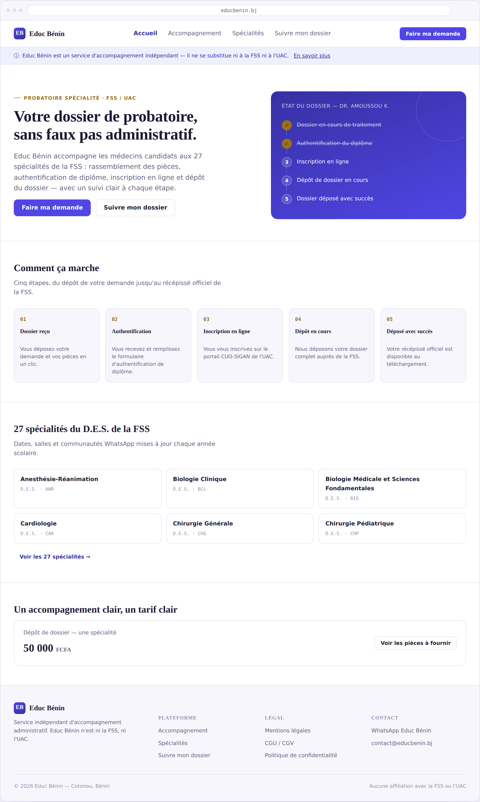 — vue complète : nav, bandeau d'avertissement, hero, "Comment ça marche", grille des spécialités (extrait), tarif, pied de page.
- 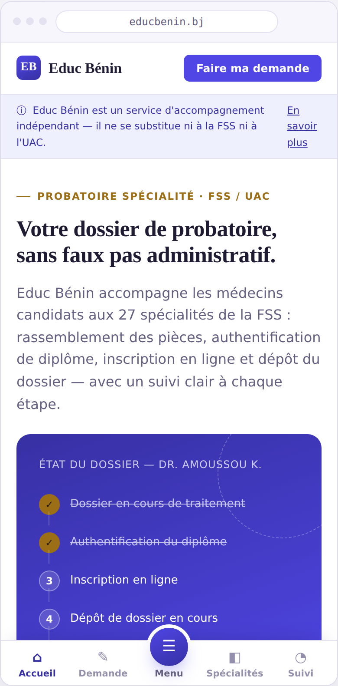 — hero en une colonne, illustration entre le sous-titre et les CTA, barre de navigation mobile en bas.
-  — feuille ouverte depuis le bouton central de la barre mobile.

### Layout & visual design
- Navigation (`.p-nav`) : logo "Educ Bénin" (carré dégradé indigo 28×28px "EB" + texte serif 700 17px) à gauche ; liens `.p-links` (Accueil actif en `--prod-primary-dark` 600, autres liens `--prod-ink-muted` 500) au centre ; bouton `.p-burger` (toujours invisible, voir Fondations) ; bouton primaire "Faire ma demande" (`.btn-primary.btn-sm`) à droite. Padding `16px 32px`, bordure basse `--prod-border`.
- **Bandeau d'avertissement** (`.disclaimer-bar`) : fond `--prod-primary-tint`, texte `--prod-primary-dark` 12.5px — *"ⓘ Educ Bénin est un service d'accompagnement indépendant — il ne se substitue ni à la FSS ni à l'UAC."* + lien souligné "En savoir plus" vers Mentions légales. ⚠️ **Ce bandeau n'apparaît que sur l'écran Accueil** — il n'est pas répété sur Accompagnement, Suivi, Spécialités ou les pages légales (vérifié dans le code, absent des autres `<section>`).
- **Hero** (`.hero`) : grille CSS 2 colonnes desktop, `grid-template-columns:1.1fr .9fr`, avec `grid-template-areas:"text art" "cta art"` — le texte et les CTA partagent la colonne de gauche (empilés), l'illustration occupe toute la hauteur à droite. `padding:64px 32px 52px`. Eyebrow or "PROBATOIRE SPÉCIALITÉ · FSS / UAC" avec petit trait avant (`::before`, 16×1px, couleur or). Titre H1 38px. Paragraphe `.lead` 16px `--prod-ink-muted`, `max-width:46ch`.
  - **Illustration hero** (`.hero-art`) : carte dégradé `linear-gradient(160deg, --prod-primary-dark, --prod-primary)`, texte blanc, `border-radius:16px`, `padding:26px`. Contient un sceau décoratif (cercle en tirets, 150×150px, en haut à droite, débordant). Sous-titre "ÉTAT DU DOSSIER — DR. AMOUSSOU K." (12px, majuscules, opacité .75). Piste verticale (`.hero-track`) de 5 lignes reliées par un trait vertical semi-transparent : les 2 premières marquées "done" (pastille or pleine, coche ✓, libellé barré à opacité .7), les 3 suivantes "à venir" (pastille translucide, numéro). Étapes affichées : "Dossier en cours de traitement" (fait), "Authentification du diplôme" (fait), "Inscription en ligne" (3), "Dépôt de dossier en cours" (4), "Dossier déposé avec succès" (5). C'est un exemple statique fixe, pas lié à un vrai dossier.
  - **CTA** : "Faire ma demande" (primaire) + "Suivre mon dossier" (outline), `gap:12px`.
- **Section "Comment ça marche"** : titre + sous-titre, puis `.steps-grid` — grille 5 colonnes égales desktop (2 colonnes en mobile), cartes `.step-card` (fond `--prod-surface-2`, bordure, `padding:16px 14px`, `border-radius:12px`) avec numéro mono or ("01".."05"), titre serif 13.5px, description 12px muted.
- **Section "27 spécialités du D.E.S. de la FSS"** : `.spec-grid` (grille 3 colonnes desktop / 2 mobile, `gap:12px`/`9px`) affichant les **6 premières** spécialités du tableau `SPECIALTIES` (tuiles simples, non cliquables ici — voir plus bas), suivi d'un bouton fantôme "Voir les 27 spécialités →" vers l'écran Spécialités.
- **Section tarif** : `.price-box` — carte bordée flex `justify-content:space-between`, montant serif 26px "50 000 FCFA" (le mot FCFA en 14px muted), + bouton outline "Voir les pièces à fournir" vers Accompagnement.
- **Pied de page** (`.footer`) : fond `--prod-surface-2`, grille 4 colonnes (`1.4fr 1fr 1fr 1fr` desktop, 2 colonnes mobile) — bloc marque + description, "Plateforme" (3 liens), "Légal" (3 liens), "Contact" (WhatsApp Educ Bénin, contact@educbenin.bj — liens non fonctionnels, texte seul). Ligne légale finale : *"© 2026 Educ Bénin — Cotonou, Bénin"* / *"Aucune affiliation avec la FSS ou l'UAC"*.

### Content (texte réel)
- Eyebrow : "Probatoire spécialité · FSS / UAC"
- H1 : "Votre dossier de probatoire, sans faux pas administratif."
- Lead : "Educ Bénin accompagne les médecins candidats aux 27 spécialités de la FSS : rassemblement des pièces, authentification de diplôme, inscription en ligne et dépôt du dossier — avec un suivi clair à chaque étape."
- Titre section 1 : "Comment ça marche" / sous-titre : "Cinq étapes, du dépôt de votre demande jusqu'au récépissé officiel de la FSS."
- Les 5 étapes (titre + description) :
  1. **Dossier reçu** — "Vous déposez votre demande et vos pièces en un clic."
  2. **Authentification** — "Vous recevez et remplissez le formulaire d'authentification de diplôme."
  3. **Inscription en ligne** — "Vous vous inscrivez sur le portail CUO-SIGAN de l'UAC."
  4. **Dépôt en cours** — "Nous déposons votre dossier complet auprès de la FSS."
  5. **Déposé avec succès** — "Votre récépissé officiel est disponible au téléchargement."
- Titre section 2 : "27 spécialités du D.E.S. de la FSS" / sous-titre : "Dates, salles et communautés WhatsApp mises à jour chaque année scolaire." — les 6 tuiles affichées sont les 6 premières de la liste des 27 (ordre du tableau `SPECIALTIES`, voir écran Spécialités) : Anesthésie-Réanimation, Biologie Clinique, Biologie Médicale et Sciences Fondamentales, Cardiologie, Chirurgie Générale, Chirurgie Pédiatrique.
- Titre section 3 : "Un accompagnement clair, un tarif clair" — "Dépôt de dossier — une spécialité" — "50 000 FCFA".
- Footer : "Service indépendant d'accompagnement administratif. Educ Bénin n'est ni la FSS, ni l'UAC."

### Functional behavior
- Tous les liens `data-goto="…"` (nav, CTA, footer, bandeau) déclenchent `showScreen(id)` : bascule la classe `.active` sur le `<section>` cible, met à jour le rail, l'URL simulée (`#urlbar`), remet le scroll interne à 0 ; si la cible est `dashboard`, redessine le graphique financier après un tick.
- Les tuiles de la mini-grille de spécialités sur l'accueil (`#homeSpecGrid`) ne sont **pas interactives** ici (pas d'accordéon, contrairement à l'écran Spécialités) — seul le bouton "Voir les 27 spécialités →" navigue.
- Aucune logique métier propre à cet écran au-delà de la navigation.

### Responsive / mobile differences
- `.p-links` et `.p-burger` disparaissent (`display:none`) ; remplacés par `.p-bottomnav` (`display:flex`, ancré en bas du cadre).
- `.hero` passe à 1 colonne, `grid-template-areas:"text" "art" "cta"` — **l'illustration se déplace explicitement entre le sous-titre et les boutons d'action** (et non après, comme le layout desktop pourrait le laisser penser à tort) ; `padding:34px 18px 30px`, `h1` réduit à 26px.
- `.steps-grid` passe à 2 colonnes ; `.spec-grid` (accueil) passe à 2 colonnes.
- `.footer` passe à 2 colonnes, padding réduit.
- Marge basse `66px` ajoutée au `.footer` du home (`#screen-home .footer{margin-bottom:66px}`) pour ne pas être masqué par la barre de nav mobile fixe.
- **Nav mobile du bas — site public** (`PUBLIC_NAV`, 5 items) : Accueil (⌂) · Demande (✎, va vers `accompagnement`) · **Menu** (☰, bouton central surélevé, ouvre la feuille "plus") · Spécialités (◧) · Suivi (◔).
- **Feuille "plus" — site public** (`PUBLIC_MORE_ITEMS`, titre "Menu Educ Bénin") : Accueil, Accompagnement, Spécialités, Suivre mon dossier — *séparateur* — Mentions légales, CGU / CGV, Politique de confidentialité — *séparateur* — "Accès back-office" (icône ⇥, mène à l'écran Connexion).

---

## 2. Accompagnement & demande (`accompagnement`)

### Purpose
Explique les pièces à fournir et le tarif, puis propose un formulaire de demande en 3 étapes (spécialité(s) → informations personnelles → pièces & envoi) aboutissant à un écran de confirmation avec référence de dossier.

### Screenshots
- 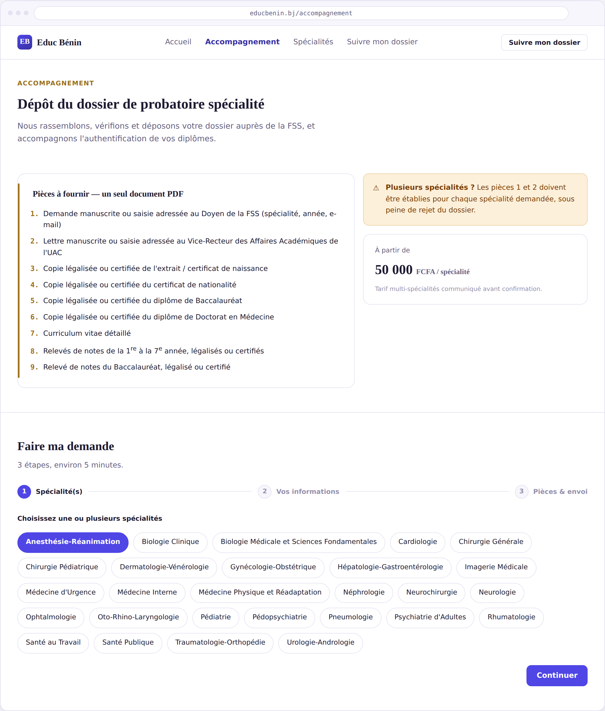
- 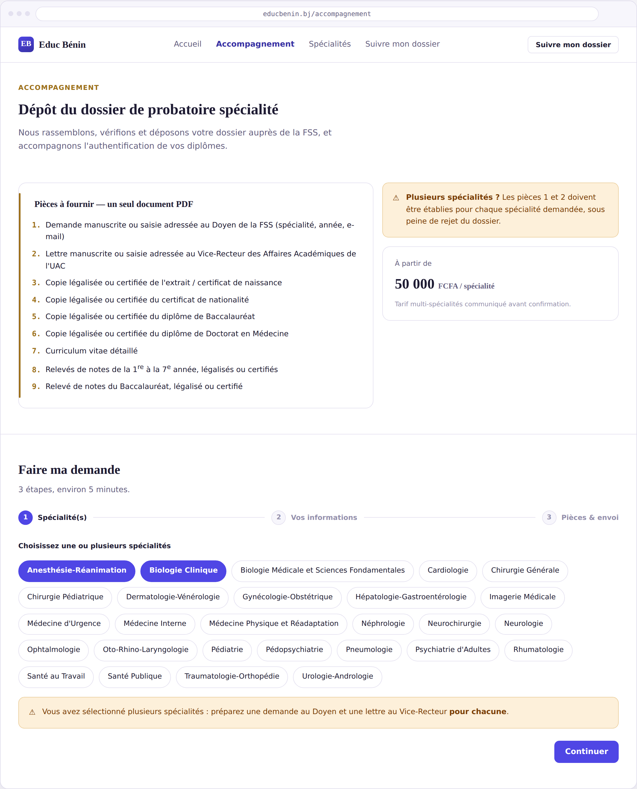 — 2 chips sélectionnées, callout dynamique visible.
- 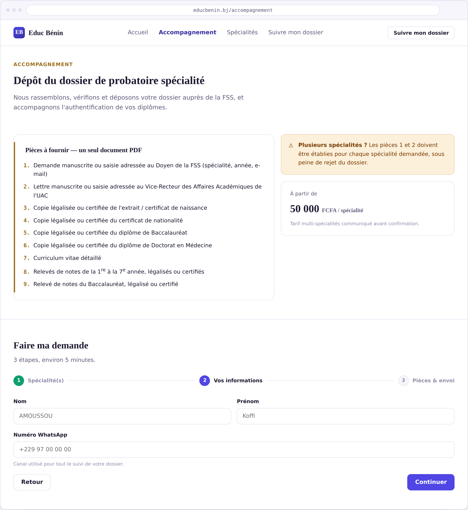
- 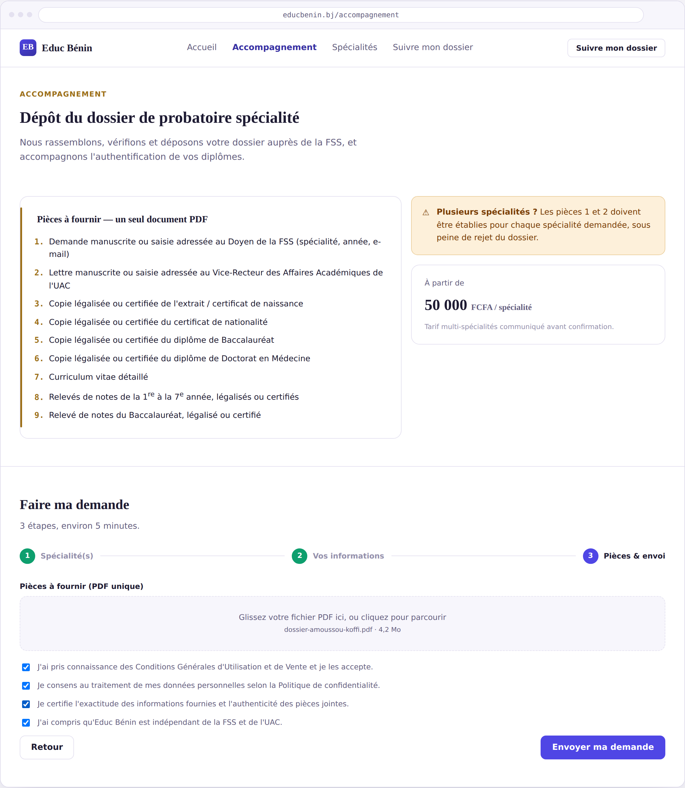
- 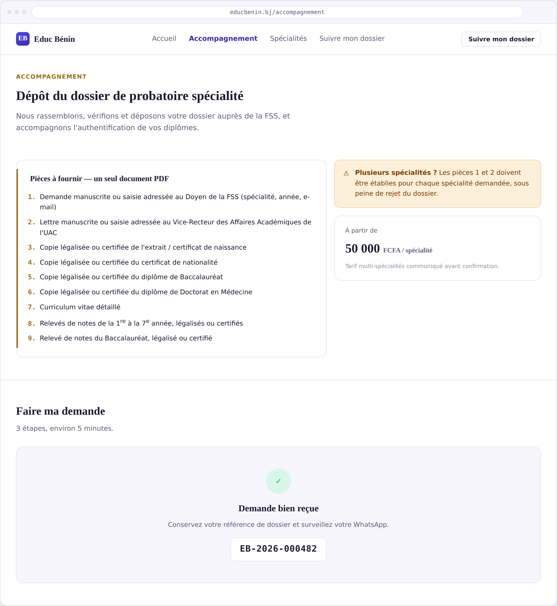
- 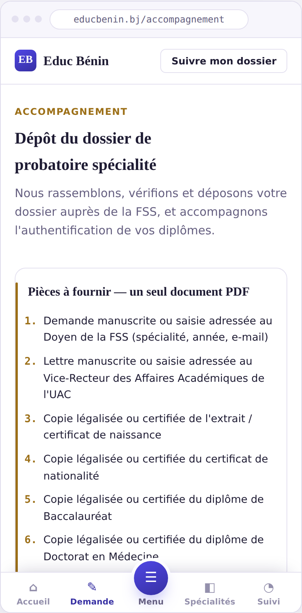
- 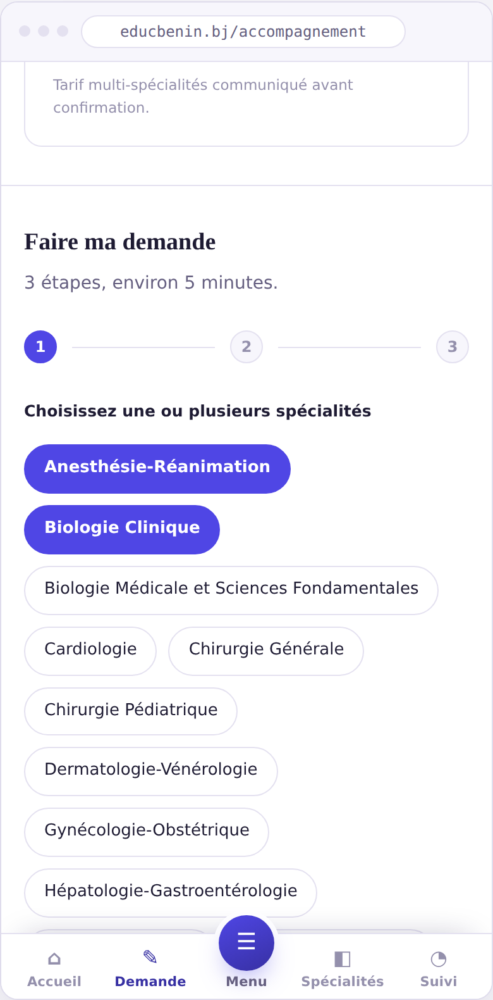
- 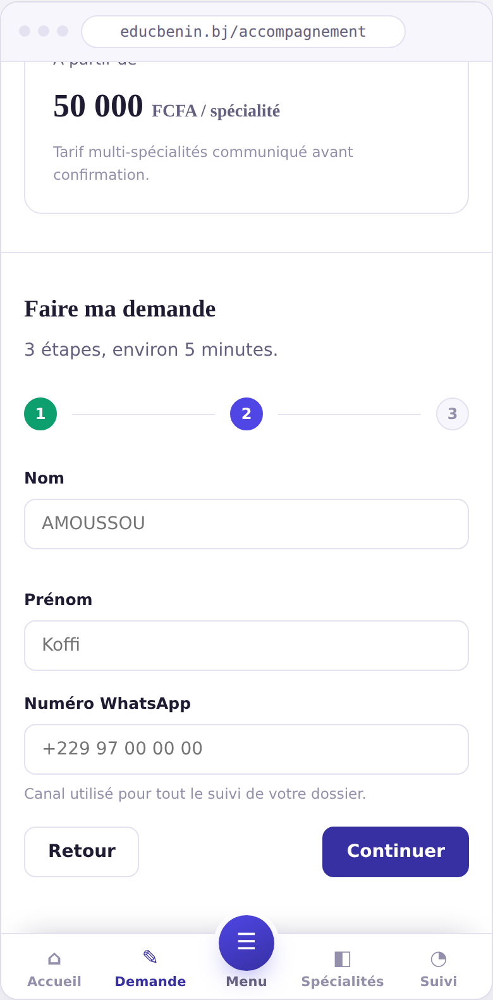
- 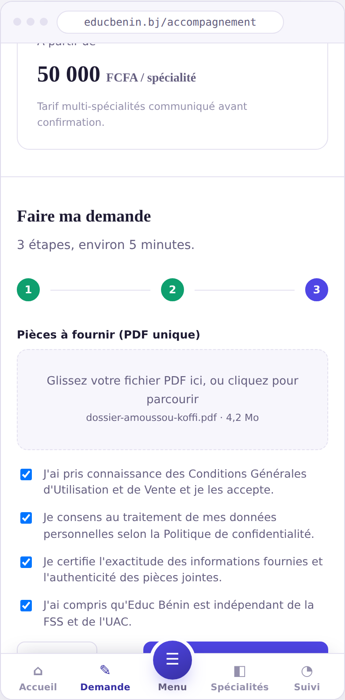
- 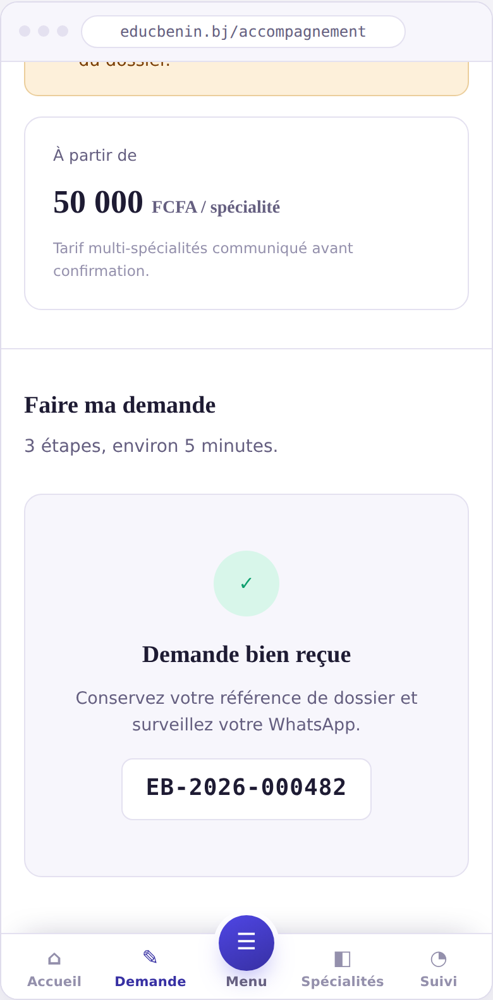

### Layout & visual design
- En-tête de page (`.page-head`) : label or "Accompagnement", H1 "Dépôt du dossier de probatoire spécialité", paragraphe descriptif.
- Bloc "Pièces à fournir" en deux colonnes (`.two-col`, `1.2fr .8fr`) :
  - Gauche : `.doc-card` — carte avec liseré or vertical à gauche (`::before`, 3px), titre "Pièces à fournir — un seul document PDF", liste ordonnée `<ol>` à 9 items, puces mono or.
  - Droite : callout d'avertissement statique (voir Content), puis un `.price-box` empilé (colonne) affichant "À partir de / 50 000 FCFA / spécialité" + note "Tarif multi-spécialités communiqué avant confirmation."
- Formulaire (`#stepper` + `.form-step`) : indicateur d'étapes horizontal (3 pastilles rondes 26px numérotées, reliées par des barres 1px) — pastille active : fond `--prod-primary` ; pastille complétée (`.done`) : fond `--prod-success` ; libellés visibles uniquement desktop (`display:none` sur mobile via `.stepper .lbl`).
  - **Étape 1** : grille de chips (`#formSpecChips`, `.chipwrap` flex-wrap) listant les **27 spécialités réelles** (voir liste complète dans la section "Spécialités" ci-dessous) — sélection multiple libre par clic. Callout d'avertissement conditionnel (`#multiSpecWarn`, masqué par défaut).
  - **Étape 2** : deux champs Nom/Prénom côte à côte (`.row2`, 1 colonne en mobile), champ "Numéro WhatsApp" pleine largeur avec indice "Canal utilisé pour tout le suivi de votre dossier."
  - **Étape 3** : zone de dépôt de fichier (`.dropzone`, bordure pointillée) simulant un fichier déjà déposé ("dossier-amoussou-koffi.pdf · 4,2 Mo"), puis 4 cases à cocher (toutes précochées dans l'exemple) avec libellés légaux.
  - **Confirmation** (`#confirmPanel`) : carte centrée, badge rond succès (✓, fond `--prod-success-tint`), titre "Demande bien reçue", texte, puis référence affichée dans un badge mono 18px : **"EB-2026-000482"**.

### Content
- Pièces à fournir (liste ordonnée exacte, 9 items) :
  1. Demande manuscrite ou saisie adressée au Doyen de la FSS (spécialité, année, e-mail)
  2. Lettre manuscrite ou saisie adressée au Vice-Recteur des Affaires Académiques de l'UAC
  3. Copie légalisée ou certifiée de l'extrait / certificat de naissance
  4. Copie légalisée ou certifiée du certificat de nationalité
  5. Copie légalisée ou certifiée du diplôme de Baccalauréat
  6. Copie légalisée ou certifiée du diplôme de Doctorat en Médecine
  7. Curriculum vitae détaillé
  8. Relevés de notes de la 1ʳᵉ à la 7ᵉ année, légalisés ou certifiés
  9. Relevé de notes du Baccalauréat, légalisé ou certifié
- **Callout statique** (texte corrigé récemment — à reproduire mot pour mot) : *"⚠ Plusieurs spécialités ? Les pièces 1 et 2 doivent être établies pour chaque spécialité demandée, sous peine de rejet du dossier."*
- **Callout dynamique de l'étape 1** (`#multiSpecWarn`, texte différent du précédent — ne pas confondre les deux) : *"⚠ Vous avez sélectionné plusieurs spécialités : préparez une demande au Doyen et une lettre au Vice-Recteur pour chacune."*
- Champs étape 2 : "Nom" (placeholder "AMOUSSOU"), "Prénom" (placeholder "Koffi"), "Numéro WhatsApp" (placeholder "+229 97 00 00 00").
- Cases à cocher étape 3 (4, toutes précochées dans l'exemple) :
  1. "J'ai pris connaissance des Conditions Générales d'Utilisation et de Vente et je les accepte."
  2. "Je consens au traitement de mes données personnelles selon la Politique de confidentialité."
  3. "Je certifie l'exactitude des informations fournies et l'authenticité des pièces jointes."
  4. "J'ai compris qu'Educ Bénin est indépendant de la FSS et de l'UAC."
- Bouton final : "Envoyer ma demande".
- Confirmation : "Demande bien reçue" / "Conservez votre référence de dossier et surveillez votre WhatsApp." / référence "EB-2026-000482".

### Functional behavior
- **Sélection de spécialités** (étape 1) : chaque clic sur une chip bascule `.sel` (toggle libre, pas de limite). La toute première chip du tableau (Anesthésie-Réanimation) est **pré-sélectionnée au chargement** (`document.querySelector('#formSpecChips .chip').classList.add('sel')` exécuté une fois au démarrage). Le compteur de chips sélectionnées pilote l'affichage du callout `#multiSpecWarn` : affiché (`display:flex`) dès que **plus d'une** chip est sélectionnée, masqué sinon.
- **Navigation entre étapes** (`goStep(n)`) : tout bouton `[data-next="n"]` (Continuer / Retour) appelle `goStep(n)`, qui bascule `.active` sur le `.form-step` correspondant et met à jour l'indicateur (`.on` pour l'étape courante, `.done` pour les étapes `< n`). Aucune validation de champs n'est implémentée dans le prototype (les boutons "Continuer" avancent sans vérifier que les champs sont remplis) — ⚠️ **à décider pour le produit réel** : le prototype ne spécifie aucune règle de validation (champs requis, format téléphone, etc.).
- **Soumission** (`#submitDemand`) : masque tous les `.form-step` (retire `.active`), cache l'indicateur d'étapes (`#stepper{display:none}`), affiche `#confirmPanel`. Aucune donnée n'est réellement envoyée (pas d'appel réseau dans le prototype, logique purement visuelle) et la référence affichée est toujours codée en dur ("EB-2026-000482"), pas générée dynamiquement.
- ⚠️ **Point de fragilité identifié en testant le prototype** : ce changement d'état se fait par `style.display` directement sur les éléments, pas via une classe — si l'utilisateur navigue vers un autre écran du rail puis revient sur "Accompagnement", le formulaire reste bloqué sur l'écran de confirmation (l'état n'est pas réinitialisé par la navigation). Comportement probablement non désiré pour le produit réel — attendu qu'un rechargement de page ou un nouveau clic sur "Faire une demande" réinitialise proprement le formulaire.

### Responsive / mobile differences
- `.two-col` passe à 1 colonne ; `.row2` passe à 1 colonne.
- Libellés textuels du stepper (`.stepper .lbl`) masqués — seules les pastilles numérotées restent visibles.
- `.form-step` et `.confirm-panel` reçoivent `margin-bottom:66px` pour ne pas être masqués par la nav mobile fixe.
- Nav mobile du bas : item "Demande" marqué actif (`.on`) sur cet écran.

---

## 3. Suivre mon dossier (`suivi`)

### Purpose
Permet à un candidat (sans compte) de retrouver son dossier via sa référence + son numéro WhatsApp, et affiche une frise chronologique (timeline) de l'état d'avancement. L'écran inclut un sélecteur de démonstration (`#trackPick`) pour prévisualiser les 6 états possibles.

### Screenshots
- 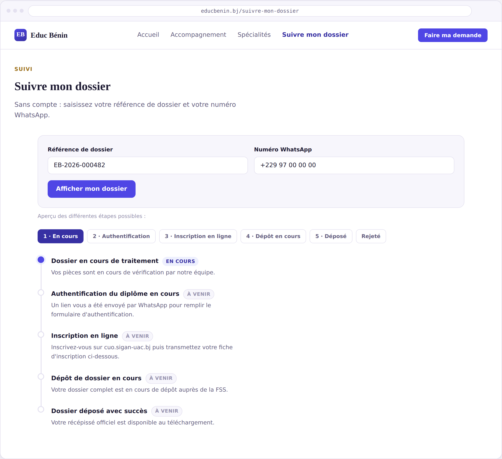
- 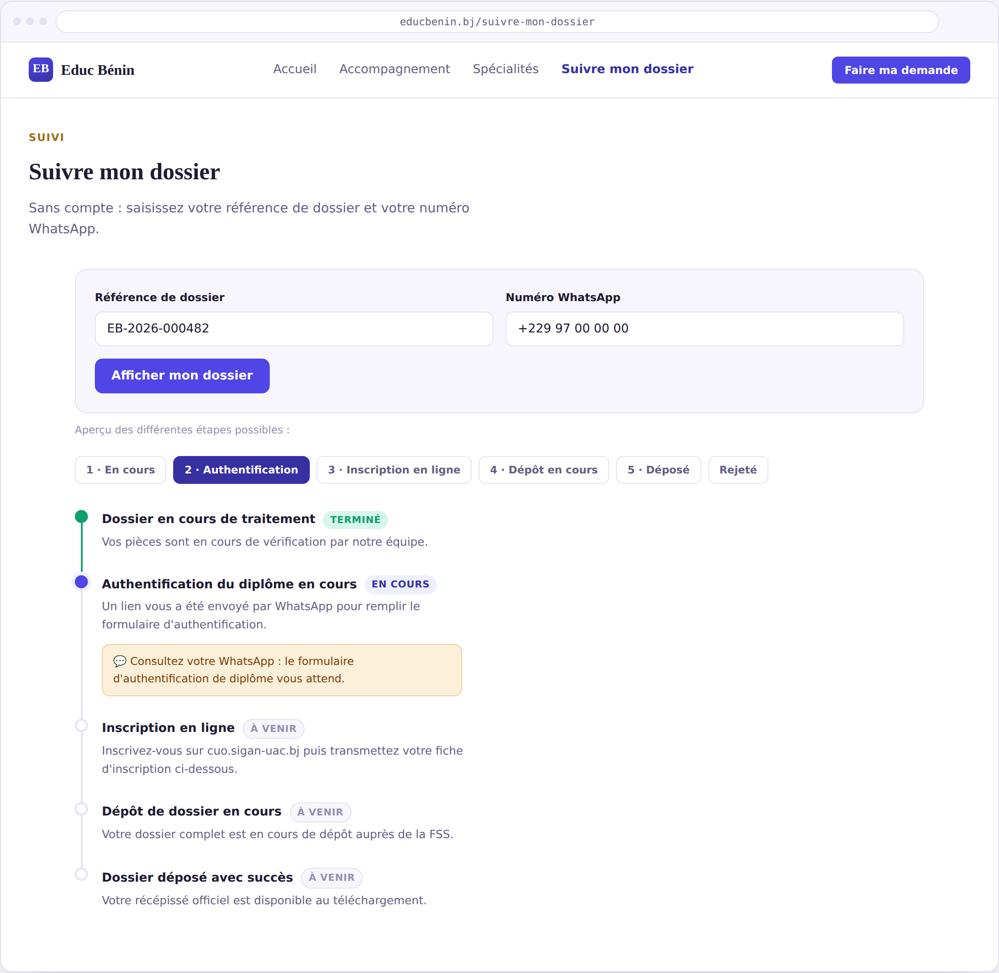
- 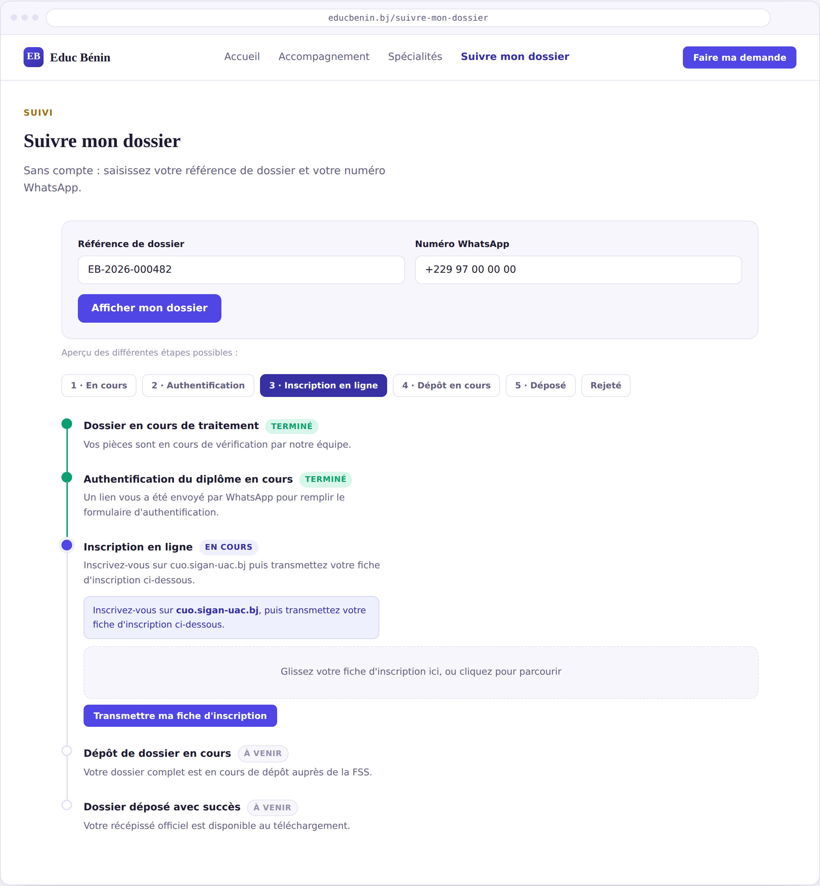
- 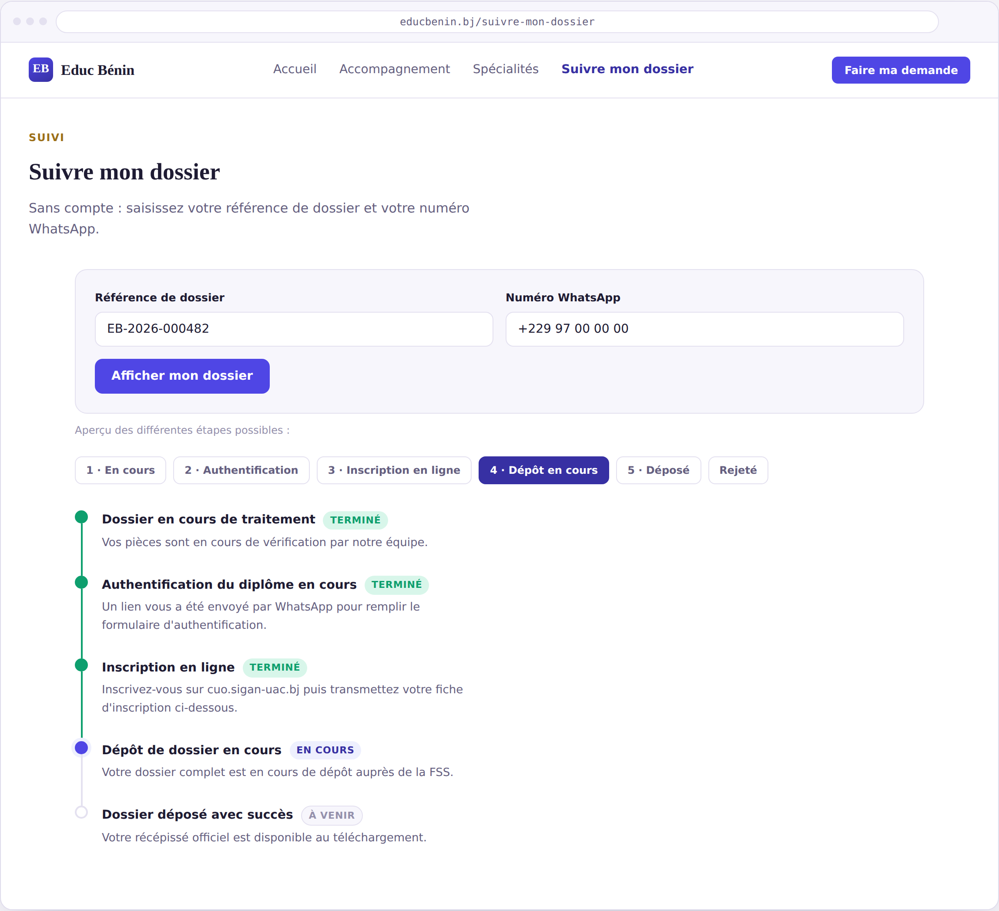
- 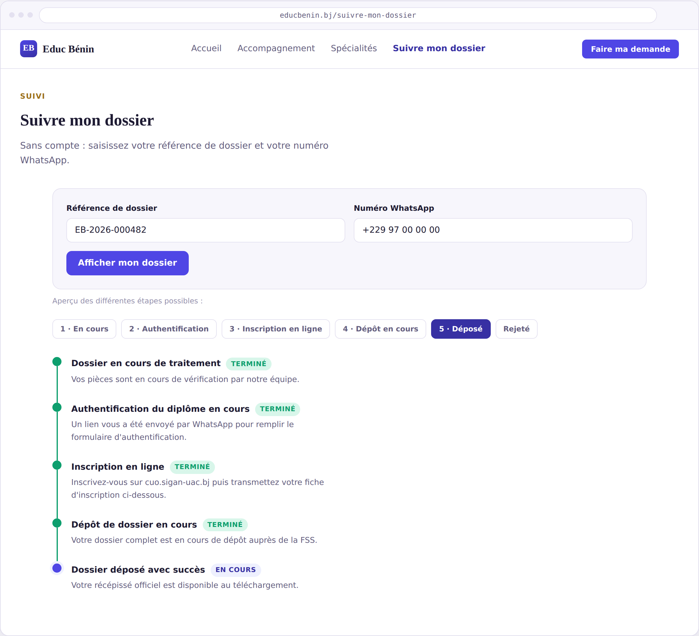
- 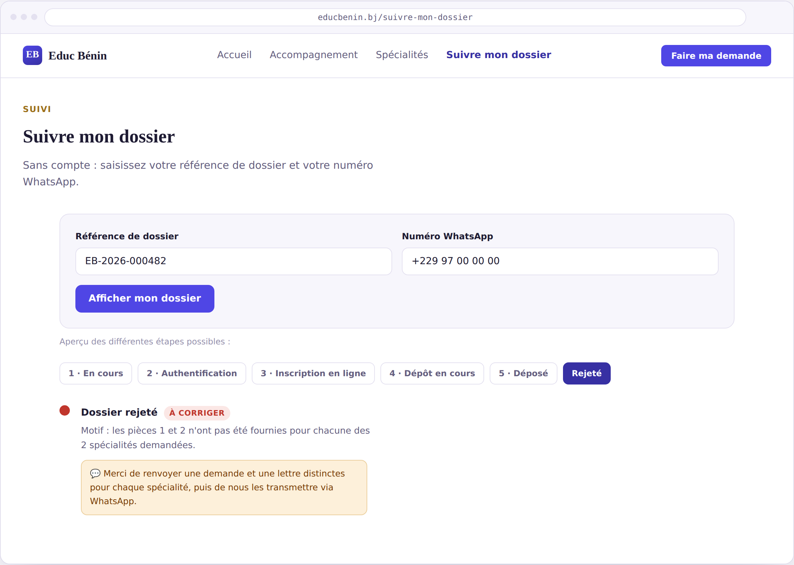
- 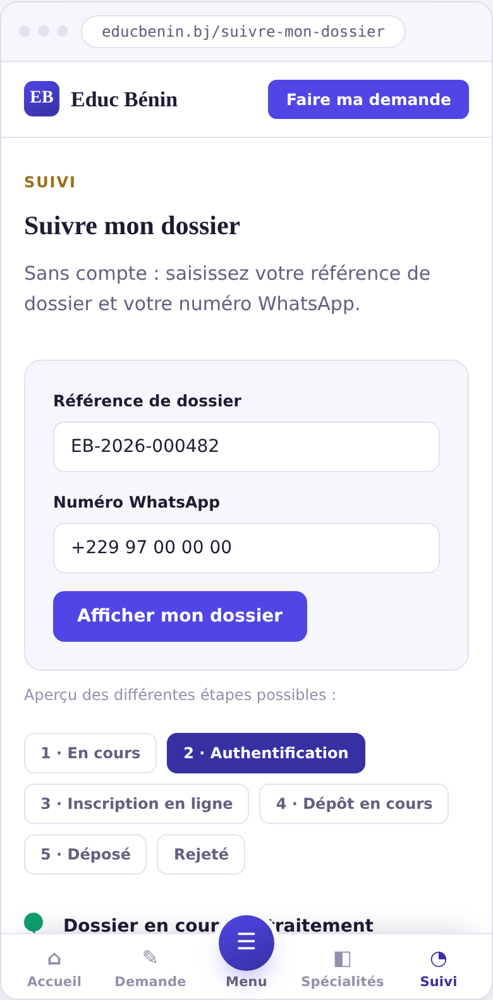

### Layout & visual design
- En-tête : label "Suivi", H1 "Suivre mon dossier", texte "Sans compte : saisissez votre référence de dossier et votre numéro WhatsApp."
- `.search-card` (fond `--prod-surface-2`, `border-radius:14px`, `padding:22px`) : deux champs côte à côte (Référence de dossier, Numéro WhatsApp — pré-remplis dans l'exemple avec "EB-2026-000482" / "+229 97 00 00 00"), puis bouton primaire pleine largeur "Afficher mon dossier".
- Sélecteur de démonstration `#trackPick` (`.track-pick`, boutons pilules 8px de rayon) : 6 boutons — "1 · En cours", "2 · Authentification", "3 · Inscription en ligne", "4 · Dépôt en cours", "5 · Déposé", "Rejeté". Le bouton actif a un fond `--prod-primary-dark`.
- **Timeline** (`#timeline`) : liste verticale de lignes (`.tl-row`), chaque ligne = une pastille (`.tl-dot`, 15px) reliée par un trait vertical (`.tl-line`, 2px) à la suivante, + un bloc texte (titre + badge de statut + description + éventuel encart contextuel).
  - Pastille : vide/bordure grise = à venir ; pleine verte = terminé (`.done`) ; pleine indigo avec halo (`box-shadow` teinte primaire) = en cours (`.now`).
  - Badge de statut (`.st`) : "Terminé" (vert), "En cours" (indigo), "À venir" (gris neutre), ou "À corriger" (rouge, cas rejet uniquement).

### Content
- Les 5 étapes normales (titre + description, identiques à `STAGE_NAMES`/`STAGES` utilisés aussi côté back-office) :
  1. **Dossier en cours de traitement** — "Vos pièces sont en cours de vérification par notre équipe."
  2. **Authentification du diplôme en cours** — "Un lien vous a été envoyé par WhatsApp pour remplir le formulaire d'authentification."
  3. **Inscription en ligne** — "Inscrivez-vous sur cuo.sigan-uac.bj puis transmettez votre fiche d'inscription ci-dessous."
  4. **Dépôt de dossier en cours** — "Votre dossier complet est en cours de dépôt auprès de la FSS."
  5. **Dossier déposé avec succès** — "Votre récépissé officiel est disponible au téléchargement."
- Encarts contextuels supplémentaires selon l'étape **en cours** :
  - Étape 2 en cours : encart jaune (`.comment-note`) — "💬 Consultez votre WhatsApp : le formulaire d'authentification de diplôme vous attend."
  - Étape 3 en cours : encart indigo (`.cuo-note`) — "Inscrivez-vous sur **cuo.sigan-uac.bj**, puis transmettez votre fiche d'inscription ci-dessous." + une zone de dépôt de fichier ("Glissez votre fiche d'inscription ici, ou cliquez pour parcourir") + bouton "Transmettre ma fiche d'inscription".
  - Étape 5 terminée : encart indigo — "📄 Récépissé de dépôt FSS disponible — **télécharger le PDF**".
- **Cas "Rejeté"** (état 0) : rendu complètement différent — une seule ligne, pastille rouge pleine, titre "Dossier rejeté" + badge rouge "À corriger", description : *"Motif : les pièces 1 et 2 n'ont pas été fournies pour chacune des 2 spécialités demandées."* + encart jaune : *"💬 Merci de renvoyer une demande et une lettre distinctes pour chaque spécialité, puis de nous les transmettre via WhatsApp."* (motif d'exemple, spécifique à ce dossier fictif).

### Functional behavior
- Champ de recherche : aucune logique de recherche réelle n'est implémentée (le bouton "Afficher mon dossier" n'a pas de handler JS) — le contenu affiché est piloté uniquement par le sélecteur de démonstration `#trackPick`, qui appelle `renderTimeline(n)` avec `n` = 0 à 5. ⚠️ **Dans le produit réel**, ce sélecteur de démo n'a évidemment pas vocation à exister — il faudra remplacer par la vraie logique de recherche (référence + WhatsApp → chargement du dossier correspondant), la fonction `renderTimeline(stage)` déjà écrite servant de base de rendu.
- État initial au chargement de l'écran : étape 2 (`renderTimeline(2)` appelé une fois au démarrage du script, indépendamment de l'écran actif).
- Le clic sur un bouton du sélecteur bascule son état `.on` (un seul actif à la fois) et redessine la timeline.

### Responsive / mobile differences
- Pas de changement structurel spécifique à cet écran au-delà des règles globales (`.container` padding réduit, marge basse 66px pour compenser la nav fixe). La timeline reste en une seule colonne quel que soit le mode (déjà verticale par nature).
- Nav mobile du bas : item "Suivi" actif.

---

## 4. Spécialités (`specialites`)

### Purpose
Page publique listant les 27 spécialités du D.E.S. de la FSS avec, pour chacune, la date/heure/salle d'examen et l'accès aux communautés WhatsApp — grille en **accordéon** : cliquer une tuile ouvre sa fiche détaillée directement en dessous, sans changer de page ni de panneau séparé.

### Screenshots
- 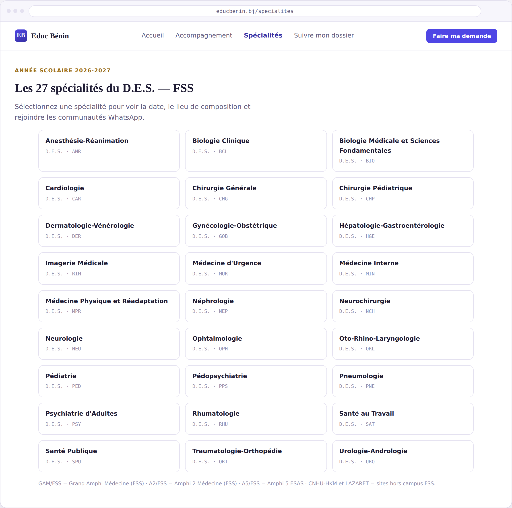
- 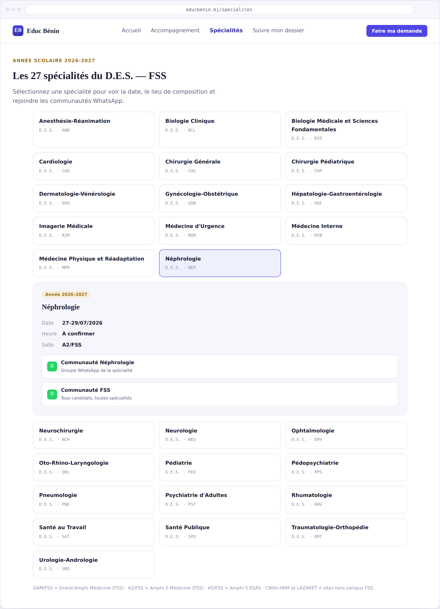 — démontre l'ouverture en place, sans défilement requis : la fiche s'insère juste après la tuile cliquée et repousse les tuiles suivantes vers le bas.
- 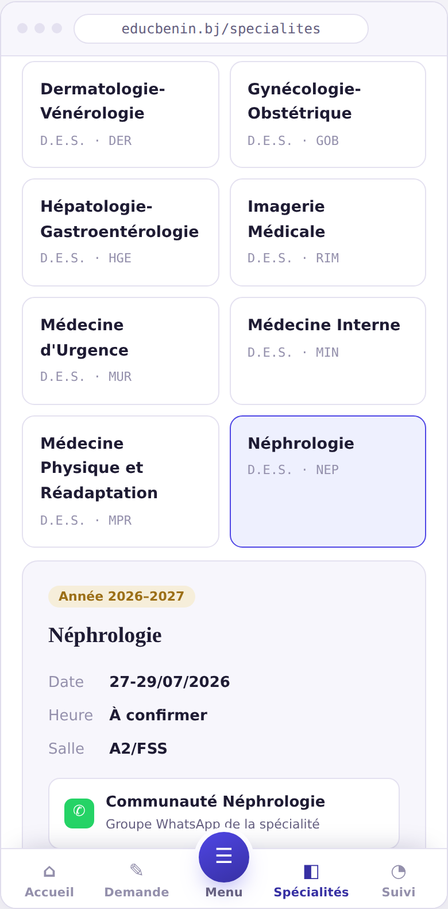

### Layout & visual design
- En-tête : label or "Année scolaire 2026-2027", H1 "Les 27 spécialités du D.E.S. — FSS", texte "Sélectionnez une spécialité pour voir la date, le lieu de composition et rejoindre les communautés WhatsApp."
- `.spec-grid#specGridFull` : grille CSS `repeat(3, 1fr)` desktop / `1fr 1fr` mobile, `gap:12px`/`9px`. Chaque tuile (`.spec-tile`) : carte bordée, nom en 13.5px 600, code en dessous ("D.E.S. · XXX") en 11px mono `--prod-ink-faint`. Tuile sélectionnée : bordure + fond `--prod-primary-tint`.
- **Mécanisme d'accordéon (le plus important de cet écran)** : quand une tuile est sélectionnée, une carte `.spec-detail` est insérée **immédiatement après cette tuile dans le flux HTML de la grille**, avec `grid-column:1/-1` — ce qui la fait s'étendre sur toute la largeur de la grille, juste en dessous de la ligne contenant la tuile cliquée (et non en bas de la grille, ni dans un panneau séparé à droite). Les tuiles suivantes du tableau sont repoussées visuellement plus bas par cet insert, mais restent dans le même flux de grille normal.
- Contenu de `.spec-detail` : badge or "Année 2026–2027", titre serif 19px (nom de la spécialité), liste définie `.kv` (grille `auto 1fr`) avec Date / Heure / Salle, puis 2 boutons pleine largeur type "WhatsApp" (`.wa-btn` — icône ronde verte `#25D366`, titre + sous-texte) : "Communauté [Nom spécialité]" (sous-texte "Groupe WhatsApp de la spécialité") et "Communauté FSS" (sous-texte "Tous candidats, toutes spécialités").
- Note de légende sous la grille (11.5px, `--prod-ink-faint`) : explique les abréviations de salle.

### Content — liste complète des 27 spécialités (nom, code, date, heure, salle — valeurs exactes)
| Nom | Code | Date | Heure | Salle |
|---|---|---|---|---|
| Anesthésie-Réanimation | ANR | 21-24/07/2026 | 08H | GAM/FSS |
| Biologie Clinique | BCL | 22/07/2026 | 09H | A2/FSS |
| Biologie Médicale et Sciences Fondamentales | BIO | À confirmer | À confirmer | A2/FSS |
| Cardiologie | CAR | 27-28/07/2026 | À confirmer | GAM/FSS |
| Chirurgie Générale | CHG | 21-23/07/2026 | 09H | A2/FSS |
| Chirurgie Pédiatrique | CHP | 21-22/07/2026 | À confirmer | A2/FSS |
| Dermatologie-Vénérologie | DER | 22-27/07/2026 | 09H | A2/FSS |
| Gynécologie-Obstétrique | GOB | 27-28/07/2026 | 10H | GAM/FSS |
| Hépatologie-Gastroentérologie | HGE | 22-23/07/2026 | 08H | A2/FSS |
| Imagerie Médicale | RIM | 27-29/07/2026 | 09H | CNHU-HKM |
| Médecine d'Urgence | MUR | 27-28/07/2026 | 08H | GAM/FSS |
| Médecine Interne | MIN | 21-22/07/2026 | À confirmer | A2/FSS |
| Médecine Physique et Réadaptation | MPR | 23/07/2026 | 08H | A2/FSS |
| Néphrologie | NEP | 27-29/07/2026 | À confirmer | A2/FSS |
| Neurochirurgie | NCH | 20-23/07/2026 | 08H | A5/FSS |
| Neurologie | NEU | 23/07/2026 | À confirmer | A5/FSS |
| Ophtalmologie | OPH | 27/07/2026 | 09H | A2/FSS |
| Oto-Rhino-Laryngologie | ORL | 20/07/2026 | 09H | CNHU-HKM |
| Pédiatrie | PED | 21-24/07/2026 | 08H | A2/FSS |
| Pédopsychiatrie | PPS | 27-28/07/2026 | 08H | CNHU-HKM |
| Pneumologie | PNE | 27/07/2026 | 09H | LAZARET |
| Psychiatrie d'Adultes | PSY | 27-28/07/2026 | 09H | CNHU-HKM |
| Rhumatologie | RHU | 23-24/07/2026 | 08H | GAM/FSS |
| Santé au Travail | SAT | 22/07/2026 | 09H | GAM/FSS |
| Santé Publique | SPU | À confirmer | À confirmer | À confirmer |
| Traumatologie-Orthopédie | ORT | 21-23/07/2026 | 09H | A5/FSS |
| Urologie-Andrologie | URO | 21-23/07/2026 | 09H | A2/FSS |

*(Ordre exact = ordre du tableau `SPECIALTIES` dans le code — c'est aussi cet ordre qui détermine quelles 6 spécialités apparaissent sur l'accueil : les 6 premières de cette liste.)*

- Légende des salles (texte exact) : *"GAM/FSS = Grand Amphi Médecine (FSS) · A2/FSS = Amphi 2 Médecine (FSS) · A5/FSS = Amphi 5 ESAS · CNHU-HKM et LAZARET = sites hors campus FSS."*

### Functional behavior (mécanisme d'accordéon détaillé)
- État géré par une seule variable JS module-privée `selectedSpecCode` (une seule tuile ouverte à la fois — pas de multi-ouverture).
- Clic sur une tuile (délégation d'événement sur `#specGridFull`, ciblant `.spec-tile`) : si le code cliqué est déjà sélectionné → désélection (`null`, ferme l'accordéon) ; sinon → sélection de ce code (ferme automatiquement toute autre tuile ouverte, en ouvre une seule).
- À chaque changement, `renderSpecGridFull()` régénère l'intégralité du HTML de `#specGridFull` : pour chaque spécialité du tableau, génère sa tuile, et si son code correspond à `selectedSpecCode`, concatène juste après le HTML de `.spec-detail` (donc la carte détail est un **sibling DOM inséré immédiatement après la tuile**, pas un panneau positionné ailleurs). C'est ce qui garantit l'ouverture "en place" sans scroll : la fiche apparaît toujours physiquement adjacente à la tuile cliquée, quelle que soit sa position dans la grille (haut, milieu, bas).
- Les boutons WhatsApp à l'intérieur de la fiche détail n'ont pas de comportement de clic implémenté dans le prototype (pas de lien `href` réel) — à considérer comme des placeholders visuels pour de vrais liens `wa.me/...` dans le produit final.

### Responsive / mobile differences
- Grille passe de 3 à 2 colonnes (`gap:9px`). Le mécanisme d'accordéon est identique (même JS, `grid-column:1/-1` fonctionne pareillement sur une grille à 2 colonnes) — capturé dans la capture d'écran mobile ci-dessus, tuile Néphrologie toujours en position "milieu de grille" (13ᵉ position sur 27, ligne 7 sur 14 en 2 colonnes) et la fiche s'ouvre bien juste après elle, pas en bas de la liste.
- `margin-bottom:66px` ajouté au `.container` pour compenser la nav fixe. Nav mobile du bas : item "Spécialités" actif.

---

## 5. Mentions légales (`mentions`)

### Purpose
Page légale statique : identité de l'éditeur (à compléter), hébergeur, propriété intellectuelle, clause de non-affiliation avec la FSS/l'UAC.

### Screenshots
- 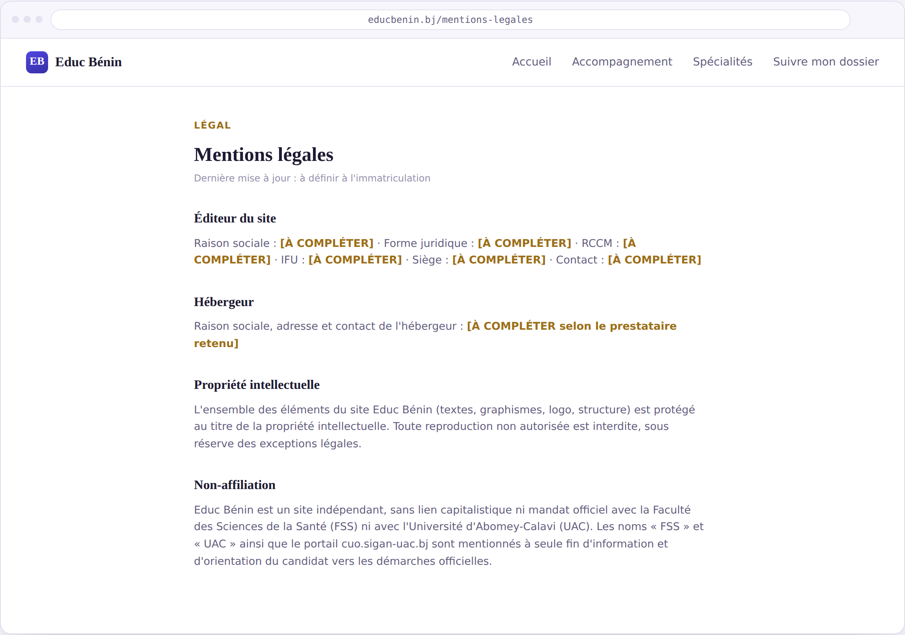
- 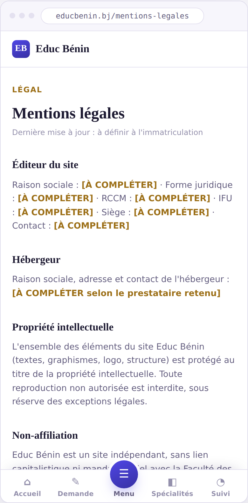

### Layout & visual design
- Conteneur `.legal` : `max-width:720px`, centré, `padding:40px 32px 70px` (26px 18px 50px mobile). Label or "Légal" (12px majuscules), H1 25px "Mentions légales", ligne "Dernière mise à jour" en 12px `--prod-ink-faint`, puis une succession de blocs `h2` (16.5px serif) + `p` (13.5px `--prod-ink-muted`).
- Les champs non finalisés sont marqués par la classe `.fill` (texte or gras) contenant littéralement **"[À COMPLÉTER]"** — convention visuelle explicite pour signaler au lecteur qu'une information juridique reste à renseigner avant mise en production.

### Content (texte intégral)
- "Dernière mise à jour : à définir à l'immatriculation"
- **Éditeur du site** : "Raison sociale : [À COMPLÉTER] · Forme juridique : [À COMPLÉTER] · RCCM : [À COMPLÉTER] · IFU : [À COMPLÉTER] · Siège : [À COMPLÉTER] · Contact : [À COMPLÉTER]"
- **Hébergeur** : "Raison sociale, adresse et contact de l'hébergeur : [À COMPLÉTER selon le prestataire retenu]"
- **Propriété intellectuelle** : "L'ensemble des éléments du site Educ Bénin (textes, graphismes, logo, structure) est protégé au titre de la propriété intellectuelle. Toute reproduction non autorisée est interdite, sous réserve des exceptions légales."
- **Non-affiliation** : "Educ Bénin est un site indépendant, sans lien capitalistique ni mandat officiel avec la Faculté des Sciences de la Santé (FSS) ni avec l'Université d'Abomey-Calavi (UAC). Les noms « FSS » et « UAC » ainsi que le portail cuo.sigan-uac.bj sont mentionnés à seule fin d'information et d'orientation du candidat vers les démarches officielles."

### Functional behavior
Aucune — page de contenu statique, seule la nav (liens, bandeau bottom-nav) est interactive.

### Responsive / mobile differences
Padding du conteneur réduit ; `margin-bottom:66px` pour compenser la nav fixe. Nav publique standard (aucun lien "on" dans `.p-links` desktop puisque cette page n'a pas de lien dédié dans la nav principale — accessible via le footer ou la feuille "plus").

---

## 6. CGU / CGV (`cgv`)

### Purpose
Conditions Générales d'Utilisation et de Vente régissant le service payant d'accompagnement.

### Screenshots
- 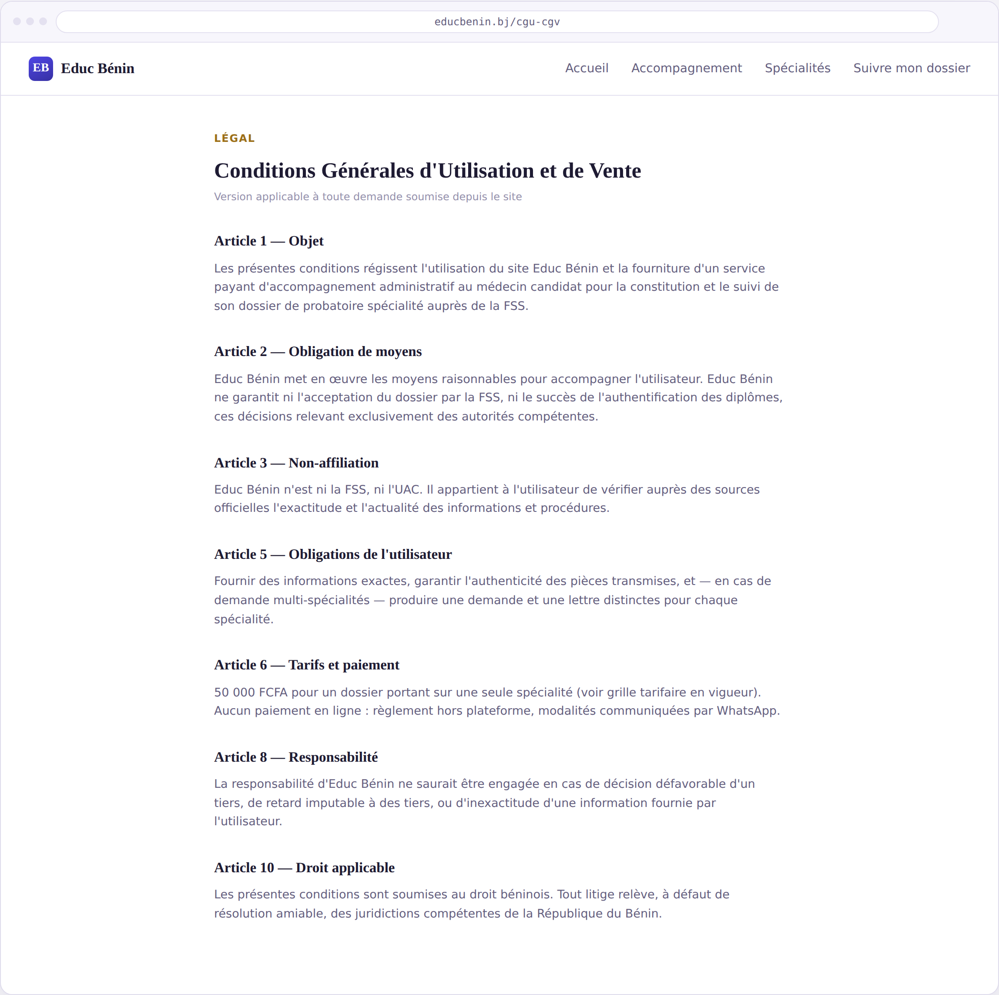
- 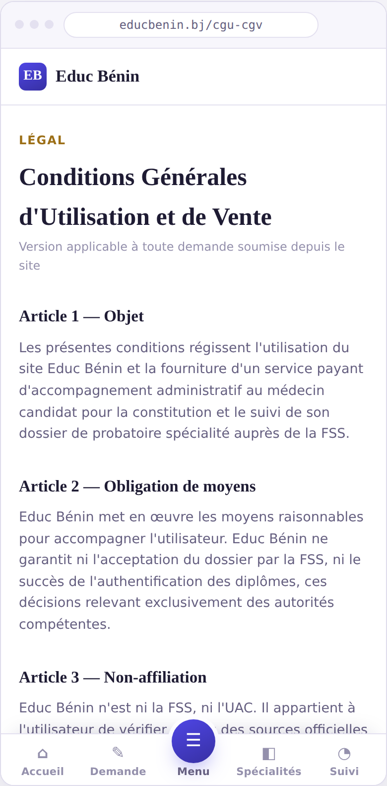

### Layout & visual design
Identique structurellement à Mentions légales (même conteneur `.legal`, mêmes styles de titres/paragraphes).

### Content (texte intégral, articles numérotés — noter que la numérotation d'origine saute des numéros, ce n'est pas une erreur de transcription : le prototype ne contient que les articles 1,2,3,5,6,8,10)
- "Version applicable à toute demande soumise depuis le site"
- **Article 1 — Objet** : "Les présentes conditions régissent l'utilisation du site Educ Bénin et la fourniture d'un service payant d'accompagnement administratif au médecin candidat pour la constitution et le suivi de son dossier de probatoire spécialité auprès de la FSS."
- **Article 2 — Obligation de moyens** : "Educ Bénin met en œuvre les moyens raisonnables pour accompagner l'utilisateur. Educ Bénin ne garantit ni l'acceptation du dossier par la FSS, ni le succès de l'authentification des diplômes, ces décisions relevant exclusivement des autorités compétentes."
- **Article 3 — Non-affiliation** : "Educ Bénin n'est ni la FSS, ni l'UAC. Il appartient à l'utilisateur de vérifier auprès des sources officielles l'exactitude et l'actualité des informations et procédures."
- **Article 5 — Obligations de l'utilisateur** : "Fournir des informations exactes, garantir l'authenticité des pièces transmises, et — en cas de demande multi-spécialités — produire une demande et une lettre distinctes pour chaque spécialité."
- **Article 6 — Tarifs et paiement** : "50 000 FCFA pour un dossier portant sur une seule spécialité (voir grille tarifaire en vigueur). Aucun paiement en ligne : règlement hors plateforme, modalités communiquées par WhatsApp."
- **Article 8 — Responsabilité** : "La responsabilité d'Educ Bénin ne saurait être engagée en cas de décision défavorable d'un tiers, de retard imputable à des tiers, ou d'inexactitude d'une information fournie par l'utilisateur."
- **Article 10 — Droit applicable** : "Les présentes conditions sont soumises au droit béninois. Tout litige relève, à défaut de résolution amiable, des juridictions compétentes de la République du Bénin."

⚠️ **À vérifier avec le client** : la numérotation lacunaire (articles 4, 7, 9 absents) est probablement volontaire dans ce brouillon de prototype (contenu encore incomplet), pas un oubli de retranscription — à confirmer avant rédaction finale des CGU/CGV réelles.

### Functional behavior
Aucune — page statique.

### Responsive / mobile differences
Identiques à Mentions légales.

---

## 7. Politique de confidentialité (`confidentialite`)

### Purpose
Politique de protection des données personnelles, référencée à la loi béninoise sur le numérique.

### Screenshots
- 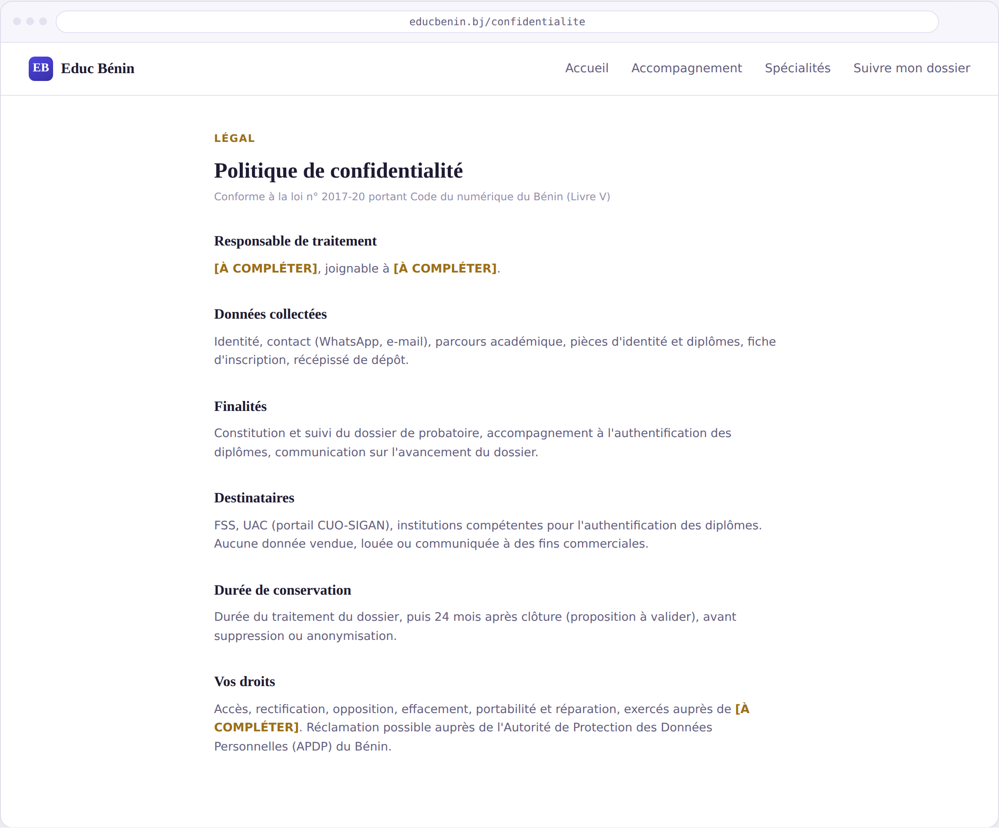
- 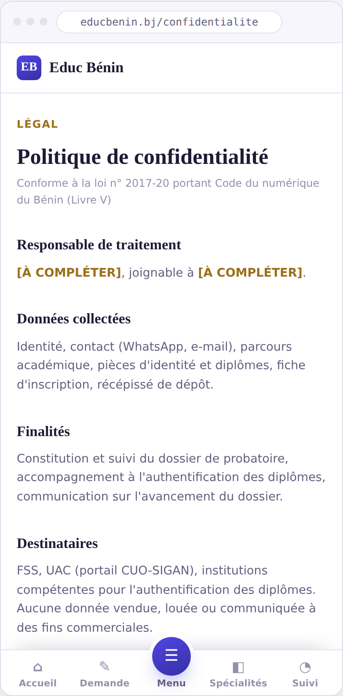

### Layout & visual design
Identique structurellement aux deux pages légales précédentes.

### Content (texte intégral)
- "Conforme à la loi n° 2017-20 portant Code du numérique du Bénin (Livre V)"
- **Responsable de traitement** : "[À COMPLÉTER], joignable à [À COMPLÉTER]."
- **Données collectées** : "Identité, contact (WhatsApp, e-mail), parcours académique, pièces d'identité et diplômes, fiche d'inscription, récépissé de dépôt."
- **Finalités** : "Constitution et suivi du dossier de probatoire, accompagnement à l'authentification des diplômes, communication sur l'avancement du dossier."
- **Destinataires** : "FSS, UAC (portail CUO-SIGAN), institutions compétentes pour l'authentification des diplômes. Aucune donnée vendue, louée ou communiquée à des fins commerciales."
- **Durée de conservation** : "Durée du traitement du dossier, puis 24 mois après clôture (proposition à valider), avant suppression ou anonymisation." — ⚠️ le texte lui-même indique "(proposition à valider)" : durée non définitive côté client.
- **Vos droits** : "Accès, rectification, opposition, effacement, portabilité et réparation, exercés auprès de [À COMPLÉTER]. Réclamation possible auprès de l'Autorité de Protection des Données Personnelles (APDP) du Bénin."

### Functional behavior
Aucune — page statique.

### Responsive / mobile differences
Identiques aux deux pages légales précédentes.

---

## 8. Connexion (`login`)

### Purpose
Écran d'authentification pour l'accès au back-office, réservé à l'équipe Educ Bénin.

### Screenshots
- 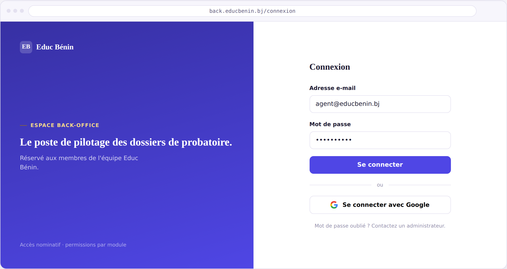
- 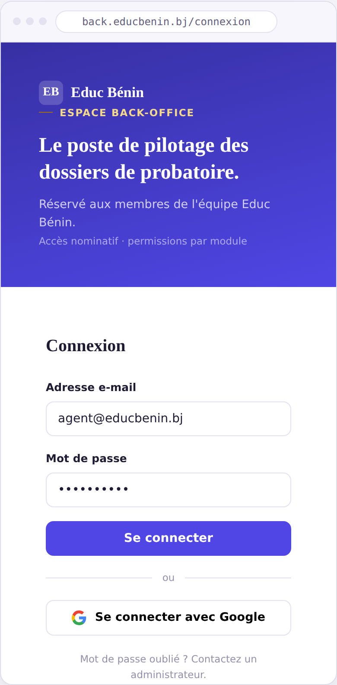

### Layout & visual design
- `.login-grid` : grille 2 colonnes égales desktop (1 colonne mobile), `min-height:560px` (0 en mobile).
- **Colonne gauche** (habillage de marque, visible desktop uniquement en pratique puisqu'empilée au-dessus en mobile) : fond dégradé `linear-gradient(165deg, --prod-primary-dark, --prod-primary)`, texte blanc, `padding:44px`, disposé en `flex-column` avec `justify-content:space-between` (logo en haut, message au milieu, mention en bas). Eyebrow spécifique en or clair `#F4D98A` (plus lumineux que le token `--prod-gold` standard, pour rester lisible sur fond foncé) : "Espace back-office". Titre H2 24px blanc : "Le poste de pilotage des dossiers de probatoire." Sous-texte 13.5px blanc à 75% d'opacité. Mention basse 11.5px à 55% d'opacité : "Accès nominatif · permissions par module".
- **Colonne droite** : formulaire centré (`max-width:320px`) — titre "Connexion" (20px), champ "Adresse e-mail" (pré-rempli "agent@educbenin.bj"), champ "Mot de passe" (type password, valeur factice "••••••••••"), bouton primaire pleine largeur "Se connecter", séparateur "ou" (`.divider`, ligne + texte centré), bouton Google (`.g-btn` — logo Google SVG 4 couleurs officiel + texte "Se connecter avec Google"), puis note "Mot de passe oublié ? Contactez un administrateur."

### Content
Voir ci-dessus — tous les textes sont déjà cités intégralement. Valeurs de démonstration : e-mail `agent@educbenin.bj`, mot de passe masqué de 10 points.

### Functional behavior
- Les deux boutons ("Se connecter" et "Se connecter avec Google") sont des liens `data-goto="dashboard"` : ils naviguent directement vers le Tableau de bord **sans aucune validation** (aucun appel réseau, aucune vérification des identifiants — pur prototype visuel). ⚠️ **Le produit réel devra bien sûr implémenter une vraie authentification** ; le bouton Google est un habillage visuel, sans intégration OAuth réelle dans le prototype (rappel : la consigne de capture d'écran demandait explicitement de bloquer les appels réseau pour éviter que ce bouton ne déclenche un vrai flux Google — confirmé qu'il ne fait *que* naviguer en interne, sans requête sortante).
- Aucun champ n'est requis ni validé.

### Responsive / mobile differences
`.login-grid` passe à 1 colonne (le panneau de marque dégradé s'empile au-dessus du formulaire), `min-height` supprimée.

---

## 9. Tableau de bord (`dashboard`)

### Purpose
Vue d'ensemble pour l'équipe : compteurs de dossiers par étape, suivi financier interne, alertes de dossiers en attente, activité récente, graphique d'encaissements, répartition par moyen de paiement.

### Screenshots
- 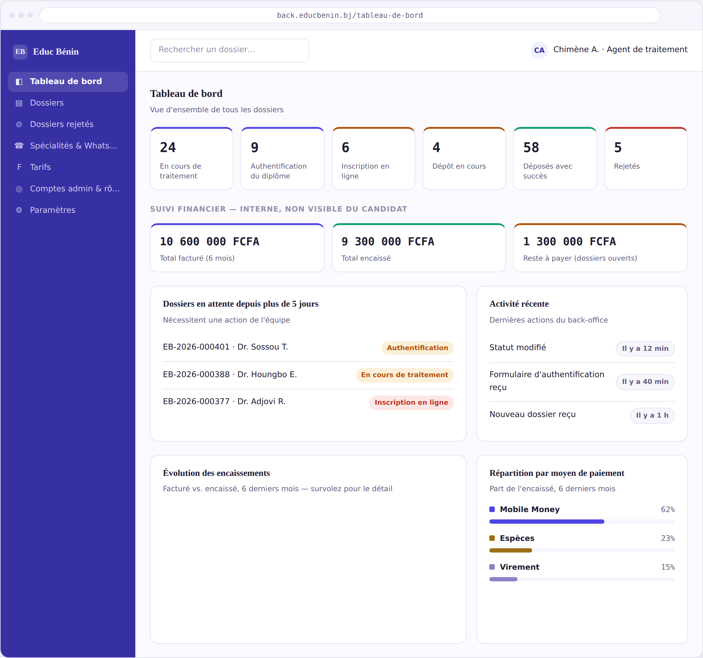
- 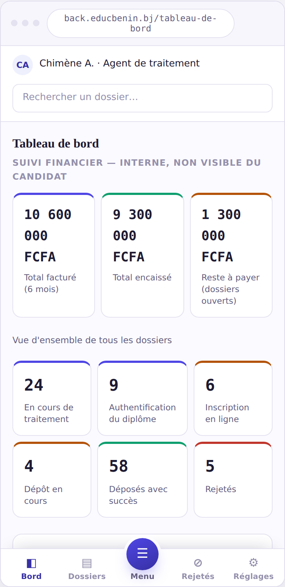
- 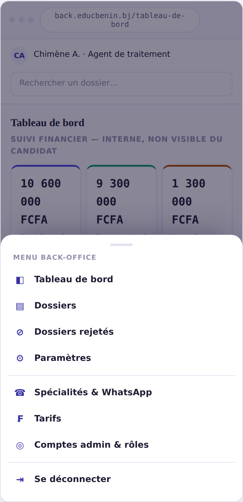

### Layout & visual design
- Structure back-office commune à tous les écrans admin (`.bo`) : `.bo-side` (barre latérale indigo foncé `--prod-primary-dark`, 220px, logo + 7 items de nav, item actif en surbrillance `rgba(255,255,255,.13)`) + `.bo-main` (fond `--prod-page`) contenant `.bo-top` (barre recherche + utilisateur) et `.bo-content` (`padding:22px 24px`).
- **Titre d'écran** : "Tableau de bord" (`.bo-h1`, 17px).
- **Bloc KPI fusionné** (`.dash-kpis`, `display:flex; flex-direction:column; gap:22px`) — **changement récent le plus important de cet écran** : les deux grilles de KPI (général + financier) sont désormais **adjacentes en haut de page**, avant les deux rangées `.two-col`, alors qu'auparavant elles étaient probablement dispersées entre les panneaux (à ne pas reproduire) :
  - `#kpiBlockGeneral` : sous-titre "Vue d'ensemble de tous les dossiers", puis `#kpiGrid` (`.kpi-grid`, `grid-template-columns:repeat(6,1fr)`) — 6 tuiles.
  - `#kpiBlockFinance` : label de section "Suivi financier — interne, non visible du candidat" (`.section-lbl`, 12px majuscules, `margin-top:0` ici), puis `#finKpiGrid` (`.kpi-grid.fin-kpi`, `grid-template-columns:repeat(3,1fr)`) — 3 tuiles, valeurs monétaires en 18px mono.
- Chaque tuile `.kpi` : carte bordée avec liseré de couleur en haut (`border-top:3px`) selon la classe (`accent` = indigo, `warn` = orange, `ok` = vert, `danger` = rouge), grand nombre mono 22px, libellé 11.5px muted.
- **Rangée 1** (`.two-col` #1, `1.2fr .8fr`, `margin-top:22px`) : panneau "Dossiers en attente depuis plus de 5 jours" (sous-texte "Nécessitent une action de l'équipe", liste `.alert-row` avec pill de statut coloré) + panneau "Activité récente" (sous-texte "Dernières actions du back-office", liste avec pill neutre horodatée).
- **Rangée 2** (`.two-col` #2) : panneau "Évolution des encaissements" (canvas Chart.js, hauteur fixe 210px) + panneau "Répartition par moyen de paiement" (barres de progression `#payBreakdown`).

### Content
- KPI généraux (`#kpiGrid`, 6 tuiles, exactes) :
  | Valeur | Libellé | Style |
  |---|---|---|
  | 24 | En cours de traitement | accent (indigo) |
  | 9 | Authentification du diplôme | accent |
  | 6 | Inscription en ligne | warn |
  | 4 | Dépôt en cours | warn |
  | 58 | Déposés avec succès | ok |
  | 5 | Rejetés | danger |
- KPI financiers (`#finKpiGrid`, 3 tuiles, calculés dynamiquement à partir des séries ci-dessous — 6 derniers mois) :
  - "Total facturé (6 mois)" = somme de `FIN_FACTURE` = **10 600 000 FCFA**
  - "Total encaissé" = somme de `FIN_ENCAISSE` = **9 300 000 FCFA**
  - "Reste à payer (dossiers ouverts)" = facturé − encaissé = **1 300 000 FCFA**
- Panneau "Dossiers en attente" (contenu statique d'exemple, 3 lignes) :
  - "EB-2026-000401 · Dr. Sossou T." — pill warn "Authentification"
  - "EB-2026-000388 · Dr. Houngbo E." — pill warn "En cours de traitement"
  - "EB-2026-000377 · Dr. Adjovi R." — pill danger "Inscription en ligne"
- Panneau "Activité récente" (statique) : "Statut modifié" (il y a 12 min), "Formulaire d'authentification reçu" (il y a 40 min), "Nouveau dossier reçu" (il y a 1 h).
- Graphique d'encaissements — mois : Avr, Mai, Juin, Juil, Août, Sept ; série "Facturé" : 1 250 000 / 1 400 000 / 1 600 000 / 1 800 000 / 2 100 000 / 2 450 000 ; série "Encaissé" : 1 100 000 / 1 300 000 / 1 450 000 / 1 600 000 / 1 850 000 / 2 000 000 (FCFA).
- Répartition par moyen de paiement : Mobile Money 62% (couleur `#4F46E5`), Espèces 23% (`#9C6F17`), Virement 15% (`#8B84C7`).

### Functional behavior — configuration exacte du graphique Chart.js (`#financeChart`)
- Bibliothèque : **Chart.js 4.4.4** (chargée depuis cdnjs).
- Type : `line`. `responsive:true, maintainAspectRatio:false`. `interaction:{mode:'index', intersect:false}`.
- **Série "Facturé"** : `borderColor:'#9490AC'` (= `--prod-ink-faint`), **ligne en tirets** `borderDash:[4,3]`, `borderWidth:2`, `pointRadius:3`, pas de remplissage (`fill:false`), `tension:.3` (courbe adoucie).
- **Série "Encaissé"** : `borderColor:'#4F46E5'` (primaire), `backgroundColor:'rgba(79,70,229,.10)'`, **remplissage actif** (`fill:true`), `borderWidth:2.5`, `pointRadius:4`, `tension:.3`.
- Légende : position top, alignée à droite (`align:'end'`), puces rondes 9px, police IBM Plex Sans 11.5px, couleur `#655F80`.
- Infobulle (tooltip) : fond `#1E1B33` (= `--prod-ink`), padding 10px, coins arrondis 8px, titre en IBM Plex Sans 600, corps en IBM Plex Mono ; format du texte de chaque ligne : `"<Libellé série> : <montant formaté> FCFA"` avec séparateur de milliers français (fonction `fmtF2`, qui remplace l'espace fine insécable normalement produite par `toLocaleString('fr-FR')` par une espace normale sécable — commentaire du code : *pour permettre le retour à la ligne dans les vignettes financières étroites (mobile, 3 colonnes)*).
- Axe X : pas de grille (`grid:{display:false}`), graduations en IBM Plex Sans 11.5px, couleur `--prod-ink-faint`.
- Axe Y : grille couleur `--prod-border` (`#E4E1F0`), pas de ligne de bordure d'axe, graduations en IBM Plex Mono 10.5px, **formatées en millions** (`(v/1000000).toFixed(1)+'M'`, ex. "1.3M").
- **Garde de rendu importante** : le graphique n'est (re)créé/redimensionné que si l'écran Tableau de bord est actuellement `.active` (`dashScreen.classList.contains('active')`) — sinon la fonction sort sans rien faire. Commentaire du code : *"écran caché (display:none) : ni créer ni redimensionner ici, un canvas à taille nulle fausserait durablement le rendu Chart.js"*. Le graphique est (re)dessiné : au premier chargement du script si le dashboard est déjà actif, à chaque navigation vers `dashboard` (`showScreen` appelle `setTimeout(renderFinanceChart, 0)`), et à chaque bascule Bureau/Mobile (`setTimeout(renderFinanceChart, 260)` — délai plus long ici pour laisser le temps à la transition CSS de largeur du cadre de se terminer avant de redimensionner le canvas). Une instance déjà créée n'est jamais recréée : un second appel se contente de `.resize()`.
- **Mécanisme de réordonnancement des KPI en mobile (le plus important de cet écran — à comprendre précisément)** :
  - Dans le HTML/DOM, l'ordre est **toujours** : `#kpiBlockGeneral` (6 tuiles générales) **puis** `#kpiBlockFinance` (3 tuiles financières) — cet ordre du code source est volontairement conservé pour le bureau et pour la sémantique/l'accessibilité (lecture logique : vue d'ensemble d'abord, finances ensuite).
  - Une règle CSS **uniquement présente dans la container query mobile** (`@container frame (max-width:760px)`) applique `#kpiBlockFinance{order:-1}` sur le conteneur flex `.dash-kpis` (`display:flex; flex-direction:column`). Comme `#kpiBlockGeneral` garde son `order` par défaut (`0`), et que `#kpiBlockFinance` reçoit `order:-1`, **le bloc financier est repositionné visuellement en premier sur mobile**, sans que l'ordre du DOM/HTML ne change — c'est purement un réordonnancement visuel CSS Flexbox (propriété `order`), une technique délibérée pour découpler l'ordre sémantique/desktop de l'ordre visuel mobile.
  - Simultanément, `.kpi-grid{grid-template-columns:1fr 1fr 1fr}` en mobile : la grille générale (6 tuiles) passe donc de 6 colonnes à **3 colonnes sur 2 lignes**, et la grille financière (déjà 3 colonnes via `.fin-kpi`) reste sur **une seule ligne de 3** — les deux grilles affichent donc 3 tuiles par ligne en mobile, mais le bloc financier (1 ligne) apparaît avant le bloc général (2 lignes). Voir capture d'écran 32 : le bloc "Suivi financier" (3 montants) est visible en haut, suivi de "Vue d'ensemble de tous les dossiers" (6 compteurs sur 2 lignes) en dessous.

### Responsive / mobile differences
- Voir mécanisme KPI ci-dessus (le changement principal de cet écran).
- `.bo-side` disparaît (`display:none`) ; `.bo-bottomnav` apparaît (back-office).
- `.bo-top` passe en `flex-wrap:wrap`, la barre de recherche (`order:3`) passe sous la ligne utilisateur et prend toute la largeur.
- `.bo-content{padding-bottom:74px}` pour compenser la nav fixe.
- `.two-col` (les deux rangées de panneaux) passe à 1 colonne.
- **Nav mobile du bas — back-office** (`BO_BOTTOM_NAV`, 5 items) : "Bord" (◧, va vers dashboard) · "Dossiers" (▤) · **Menu** (☰, bouton central surélevé) · "Rejetés" (⊘) · "Réglages" (⚙, va vers parametres).
- **Feuille "plus" — back-office** (`BO_MORE_ITEMS`, titre "Menu back-office") : Tableau de bord, Dossiers, Dossiers rejetés, Paramètres — *séparateur* — Spécialités & WhatsApp, Tarifs, Comptes admin & rôles — *séparateur* — "Se déconnecter" (icône ⇥, va vers l'écran Connexion). Capturée dans la capture d'écran 57 (ouverte depuis le Tableau de bord, mais cette feuille est strictement identique — mêmes items — depuis n'importe quel écran back-office, puisqu'elle est partagée hors des `.screen`).

---

## 10. Dossiers (`dossiers`)

### Purpose
Liste de travail principale de l'équipe : filtrage par étape avec compteurs en direct, liste de dossiers, et une **modale de détail** riche (pièces jointes, actions dépendant de l'étape, onglets paiement/commentaires publics/commentaires internes).

### Screenshots
- 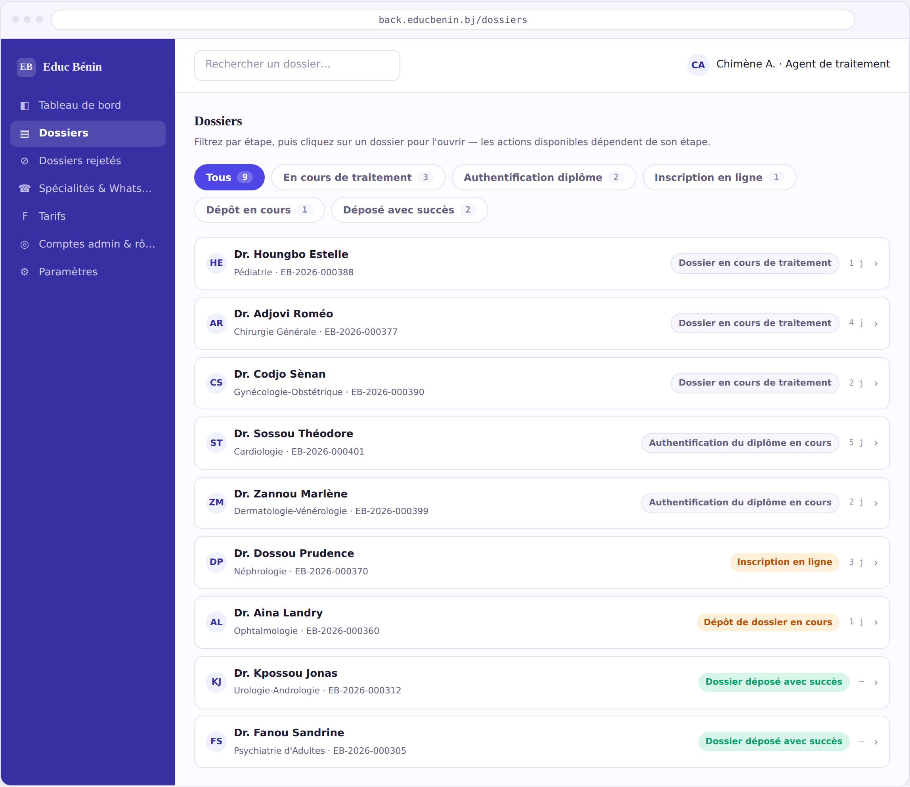
- 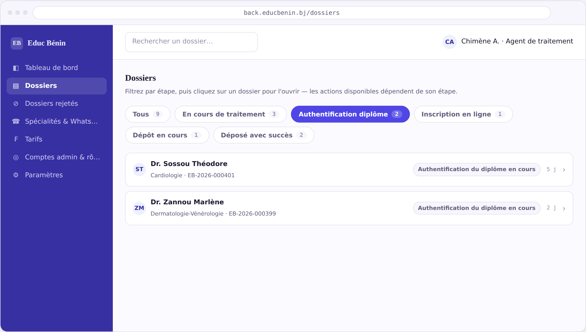
- 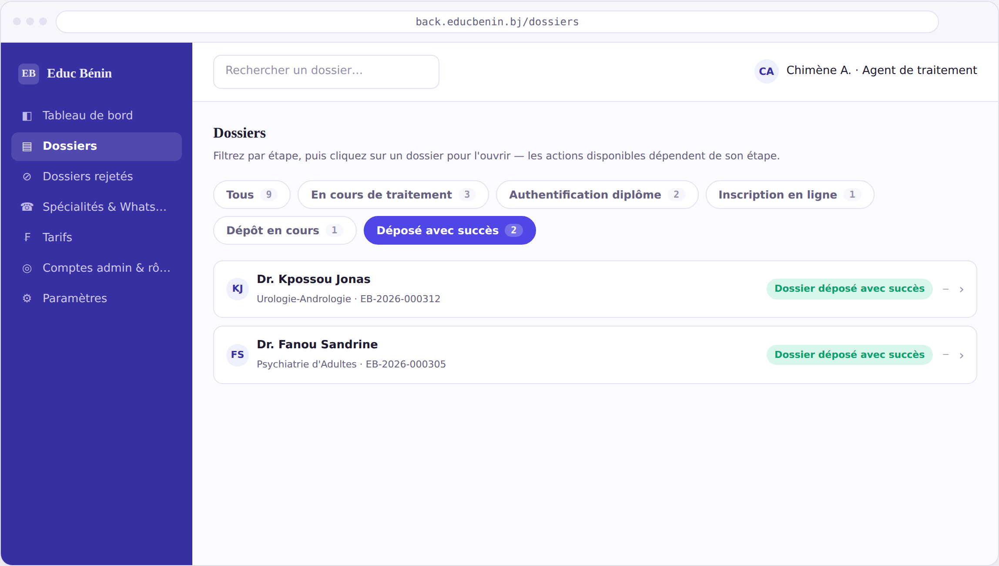
- 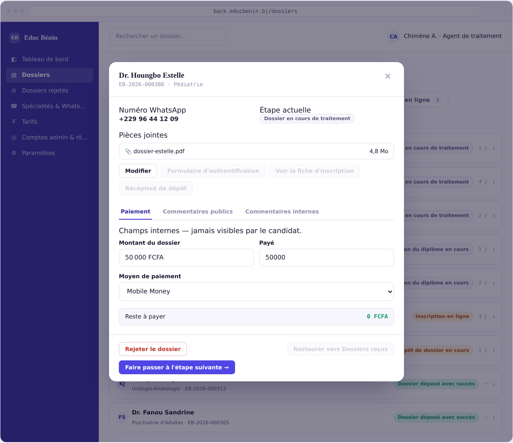
- 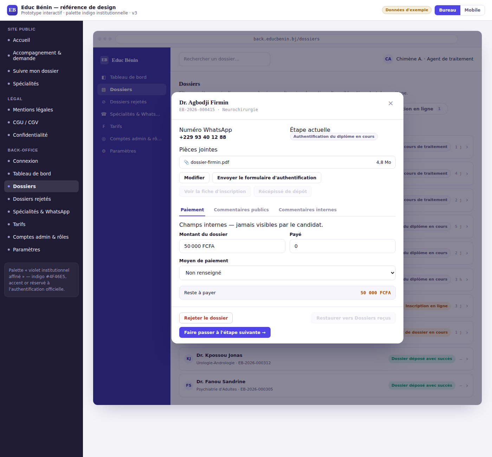
- 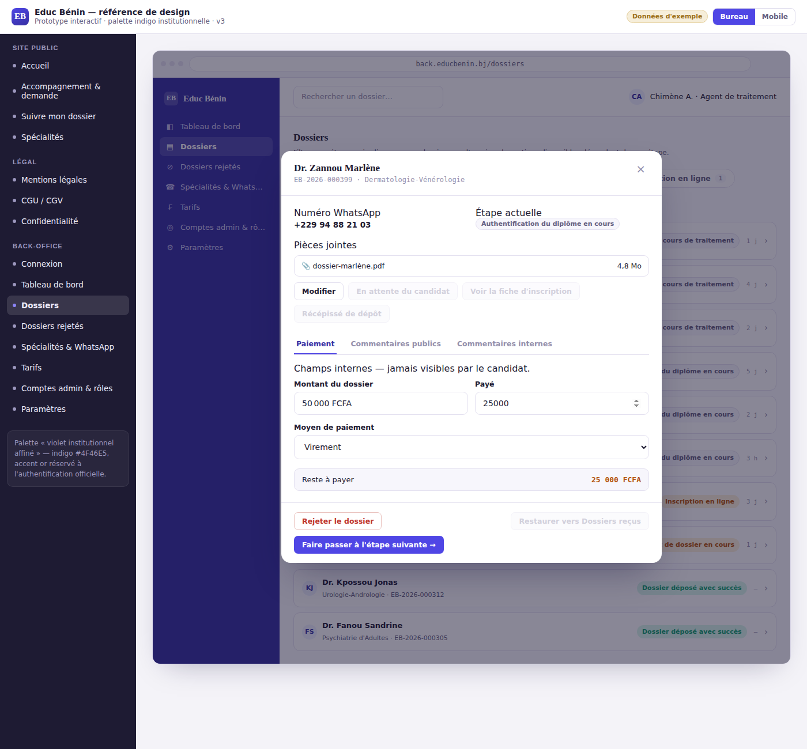
- 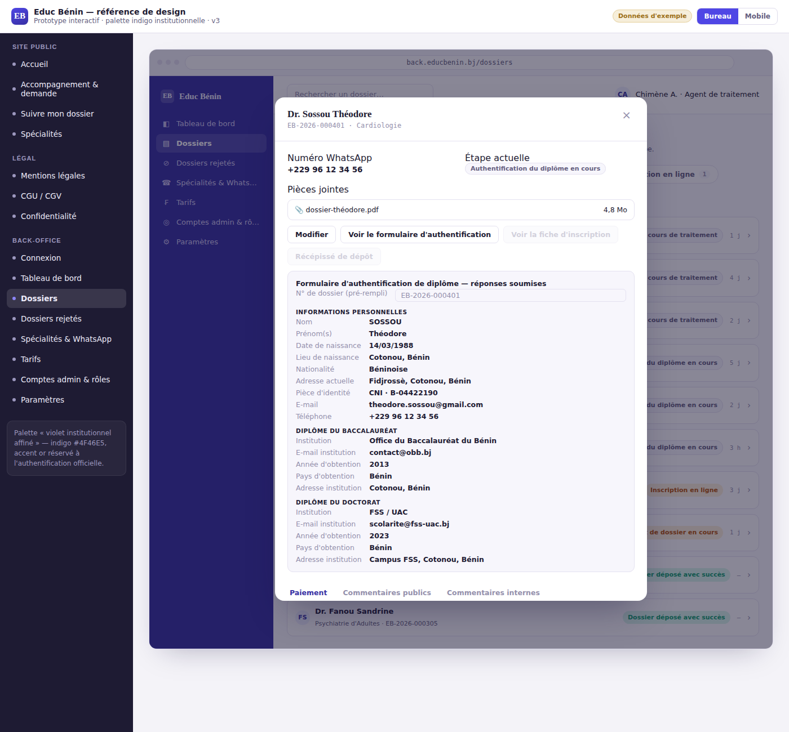
- 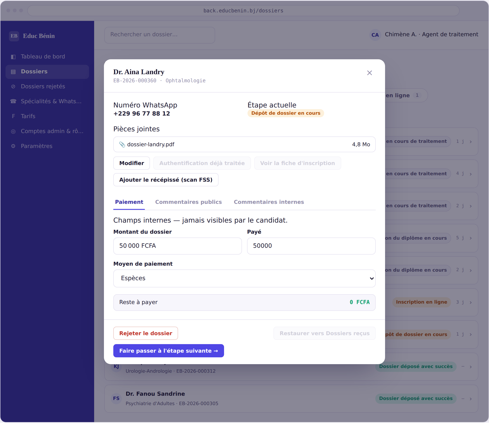
- 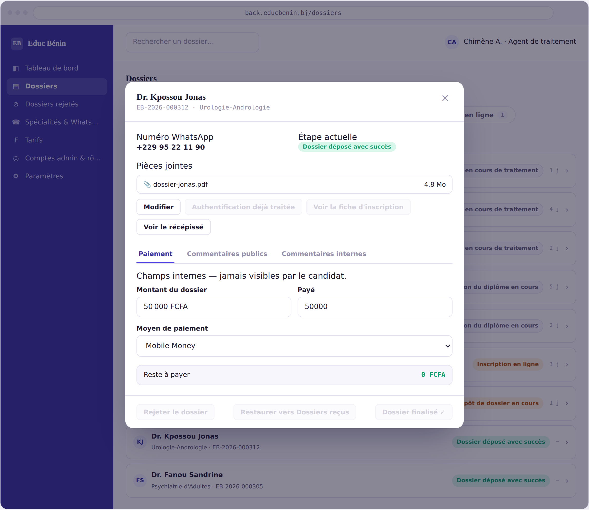
- 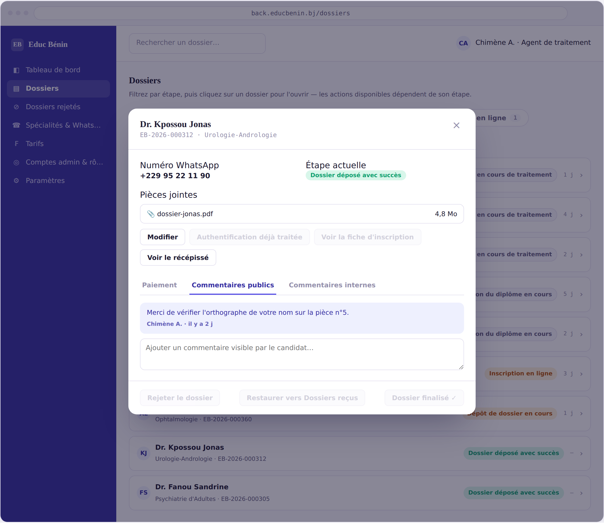
- 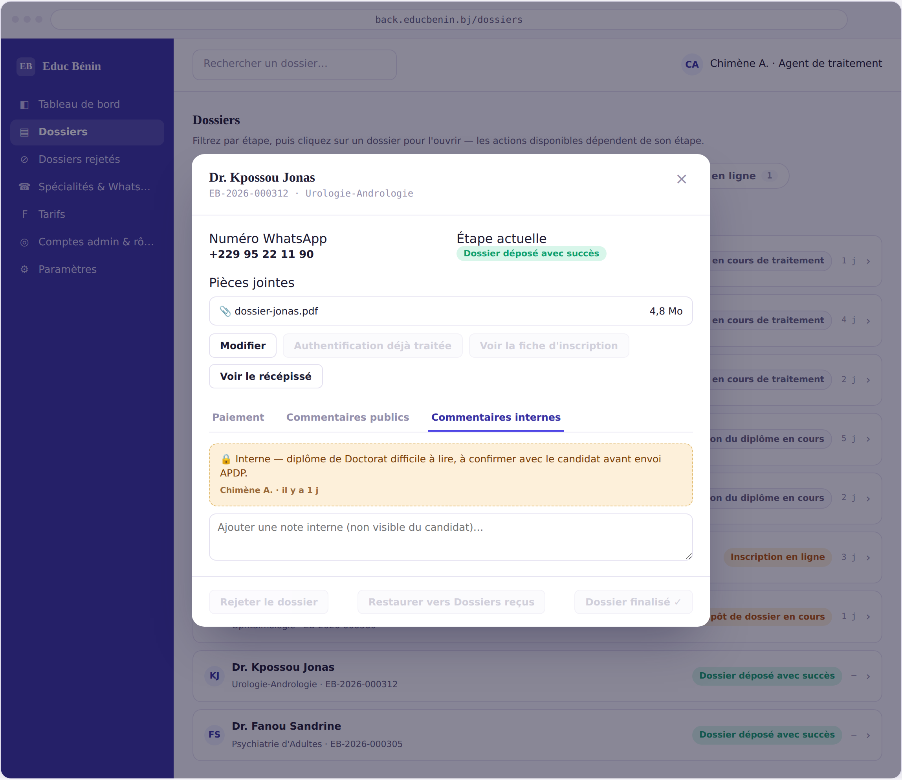
- 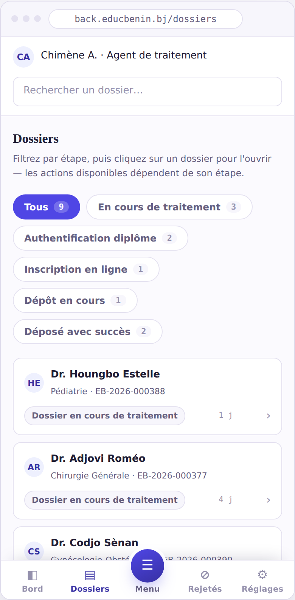
- 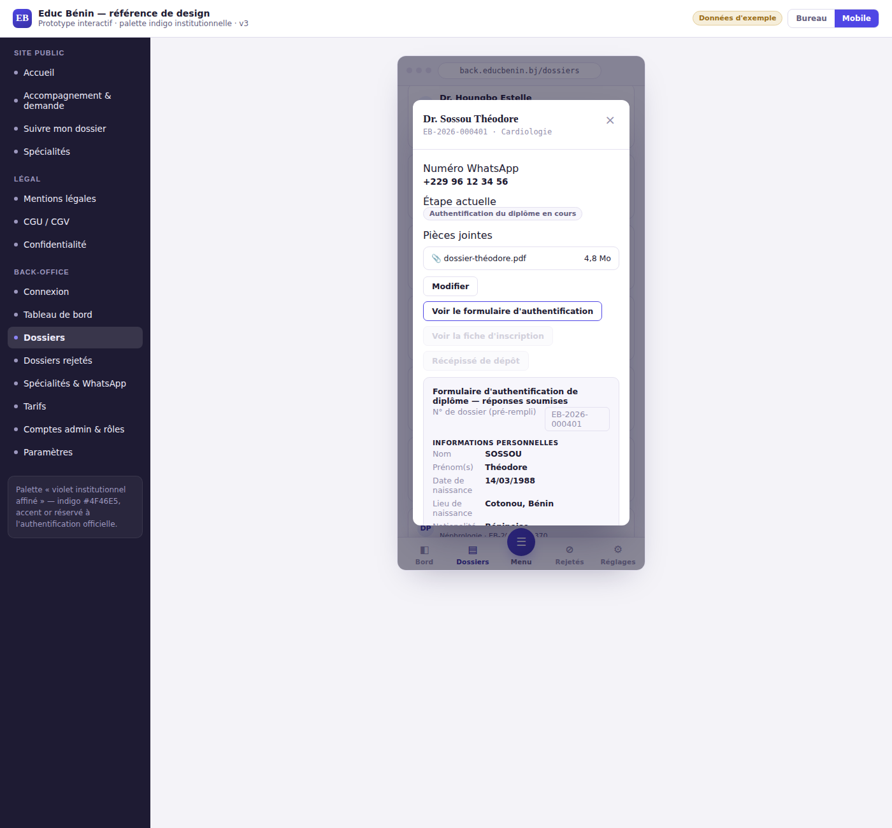

### Layout & visual design
- Titre "Dossiers" + sous-texte "Filtrez par étape, puis cliquez sur un dossier pour l'ouvrir — les actions disponibles dépendent de son étape."
- **Filtres** (`#dossierFilters`, `.dossier-filters`, flex-wrap) : chips pilules (`.df-chip`) avec compteur mono intégré (`.cnt`, fond `--prod-surface-2`) — "Tous", "En cours de traitement", "Authentification diplôme", "Inscription en ligne", "Dépôt en cours", "Déposé avec succès". Chip active : fond `--prod-primary`.
- **Liste** (`#dossierList`, `.dossier-list`, colonne, `gap:9px`) : chaque ligne (`.d-row`) = carte bordée cliquable, flex-wrap — à gauche : avatar rond avec initiales + nom + "Spécialité · Référence" ; à droite (`.meta`, poussé à droite via `margin-left:auto`) : pill de statut coloré, ancienneté ("X j"), chevron `›`. Survol : bordure indigo.
- **Modale** (`#dossierOverlay` → `.modal`, voir Fondations pour la structure générale) :
  - En-tête : nom du candidat (H3) + référence·spécialité (mono, petit, gris) + bouton fermer ×.
  - Corps : ligne 2 colonnes (Numéro WhatsApp / pill "Étape actuelle"), puis bloc "Pièces jointes" (une ligne fichier `.file-row` simulée : "📎 dossier-{nom}.pdf · 4,8 Mo").
  - **Grille d'actions** (`.actions-grid`, flex-wrap) — **exactement 4 boutons, aucun bouton "Fusionner en un seul PDF"** : "Modifier" · "Envoyer le formulaire d'authentification" (libellé variable, voir logique ci-dessous) · "Voir la fiche d'inscription" · "Voir le récépissé" (libellé variable). Chaque bouton peut être désactivé (`.is-disabled`) selon l'étape.
  - **Aperçu formulaire d'authentification** (`#authPreview`, `.preview-box`, masqué par défaut) — apparaît sous la grille d'actions quand on clique "Voir le formulaire d'authentification". Ce n'est PAS le formulaire de demande initiale (les 3 étapes de la page Accompagnement) — c'est la relecture, côté back-office, des réponses soumises par le médecin sur le **formulaire externe d'authentification de diplôme** qui lui est envoyé par WhatsApp une fois à cette étape. Structure exacte, dans cet ordre :
    1. Titre "Formulaire d'authentification de diplôme — réponses soumises" (12.5px, gras).
    2. **"N° de dossier (pré-rempli)"** → valeur affichée dans une pastille grisée en lecture seule (`dd.dd-readonly` : fond `--prod-surface-2`, texte `--prod-ink-faint`, `padding:3px 9px`, `border-radius:6px`, bordure `--prod-border`) — représente le numéro de dossier pré-rempli sur le formulaire envoyé au médecin, pour rattacher sans ambiguïté sa soumission au bon dossier.
    3. Section "INFORMATIONS PERSONNELLES" (label section, majuscules, 10.5px) → `<dl>` : Nom, Prénom(s), Date de naissance, Lieu de naissance, Nationalité, Adresse actuelle, Pièce d'identité (type · référence), E-mail, Téléphone.
    4. Section "DIPLÔME DU BACCALAURÉAT" → `<dl>` : Institution, E-mail institution, Année d'obtention, Pays d'obtention, Adresse institution.
    5. Section "DIPLÔME DU DOCTORAT" → même structure que le Bac.
    Ces champs reproduisent exactement les champs du vrai formulaire externe envoyé au médecin (fourni par le client) : informations personnelles (nom, prénom(s), date/lieu de naissance, nationalité, adresse, type et référence de pièce d'identité, e-mail, téléphone) puis, pour CHAQUE diplôme (Baccalauréat et Doctorat séparément) : e-mail de l'institution qui l'a délivré, nom de l'institution (une institution étatique, ex. "Office du Baccalauréat du Bénin", jamais une école), année d'obtention, pays d'obtention, adresse précise de l'institution — plus une pièce jointe PDF du diplôme, nommée "diplôme-nom-prénom". Le vrai formulaire précise aussi par une mention `⛔ TRÈS IMPORTANT` que le candidat recevra par e-mail, sous quelques jours, une attestation ou un récépissé de dépôt d'authentification pour chaque diplôme, et l'invite à surveiller sa boîte mail — cette mention concerne le candidat, elle n'a pas à être reproduite dans l'aperçu back-office ci-dessus, mais doit figurer sur l'écran/le message envoyé au candidat lors de la construction du vrai formulaire externe.
    Dans les données d'exemple, seul le dossier d4 (Dr. Sossou Théodore, le seul dossier étape 2 avec `authSubmitted:true`) porte un objet `authForm` complet permettant de peupler cet aperçu ; un dossier sans `authForm` afficherait un message de repli "Formulaire non encore soumis par le candidat." (garde-fou, ne devrait normalement pas être atteignable puisque le bouton n'est cliquable pour affichage que si `authSubmitted` est vrai).
  - **Aperçu fiche d'inscription** (`#fichePreview`, masqué par défaut) : une simple ligne fichier "📎 fiche-inscription-cuo.pdf · 1,1 Mo".
  - **Onglets** (`.tabbtns` + `.tabpane`) : "Paiement" (actif par défaut), "Commentaires publics", "Commentaires internes".
    - **Paiement** : note "Champs internes — jamais visibles par le candidat." ; deux champs côte à côte "Montant du dossier" (lecture seule, mono) et "Payé" (nombre éditable, pas de 1000) ; sélecteur "Moyen de paiement" (options : Non renseigné / Mobile Money / Espèces / Virement) ; résumé `.pay-summary` "Reste à payer" avec montant mono coloré (orange si > 0 via `.due`, vert si 0 via `.clear`).
    - **Commentaires publics** : une bulle d'exemple (`.bubble.pub`, fond `--prod-primary-tint`) — "Merci de vérifier l'orthographe de votre nom sur la pièce n°5." (méta "Chimène A. · il y a 2 j") + zone de texte pour ajouter un commentaire visible par le candidat.
    - **Commentaires internes** : une bulle d'exemple (`.bubble.int`, fond `--prod-warning-tint`, bordure pointillée) — "🔒 Interne — diplôme de Doctorat difficile à lire, à confirmer avec le candidat avant envoi APDP." (méta "Chimène A. · il y a 1 j") + zone de texte pour note interne (non visible du candidat).
  - **Pied de modale** (`.modal-foot`, 3 boutons) : "Rejeter le dossier" (danger outline, gauche) · "Restaurer vers Dossiers reçus" (outline, milieu) · "Faire passer à l'étape suivante →" (primaire, droite).

### Content — les 10 dossiers d'exemple (`DOSSIERS`, valeurs exactes)
| id | Référence | Nom | Spécialité | WhatsApp | Étape | authSent | authSubmitted | ficheUploaded | recepisseUploaded | Ancienneté | Montant | Payé | Moyen |
|---|---|---|---|---|---|---|---|---|---|---|---|---|---|
| d1 | EB-2026-000388 | Dr. Houngbo Estelle | Pédiatrie | +229 96 44 12 09 | 1 | non | non | non | non | 1 j | 50 000 | 50 000 | Mobile Money |
| d2 | EB-2026-000377 | Dr. Adjovi Roméo | Chirurgie Générale | +229 97 20 55 31 | 1 | non | non | non | non | 4 j | 100 000 | 50 000 | Espèces |
| d3 | EB-2026-000390 | Dr. Codjo Sènan | Gynécologie-Obstétrique | +229 95 10 44 02 | 1 | non | non | non | non | 2 j | 50 000 | 0 | Non renseigné |
| d4 | EB-2026-000401 | Dr. Sossou Théodore | Cardiologie | +229 96 12 34 56 | 2 | **oui** | **oui** | non | non | 5 j | 50 000 | 50 000 | Mobile Money |
| d5 | EB-2026-000399 | Dr. Zannou Marlène | Dermatologie-Vénérologie | +229 94 88 21 03 | 2 | **oui** | non | non | non | 2 j | 50 000 | 25 000 | Virement |
| d6 | EB-2026-000370 | Dr. Dossou Prudence | Néphrologie | +229 97 65 43 21 | 3 | oui | oui | **oui** | non | 3 j | 50 000 | 50 000 | Mobile Money |
| d7 | EB-2026-000360 | Dr. Aina Landry | Ophtalmologie | +229 96 77 88 12 | 4 | oui | oui | oui | non | 1 j | 50 000 | 50 000 | Espèces |
| d8 | EB-2026-000312 | Dr. Kpossou Jonas | Urologie-Andrologie | +229 95 22 11 90 | 5 | oui | oui | oui | **oui** | — | 50 000 | 50 000 | Mobile Money |
| d9 | EB-2026-000305 | Dr. Fanou Sandrine | Psychiatrie d'Adultes | +229 94 33 66 77 | 5 | oui | oui | oui | oui | — | 50 000 | 50 000 | Mobile Money |
| d10 | EB-2026-000415 | Dr. Agbodji Firmin | Neurochirurgie | +229 93 40 12 88 | 2 | **non** | non | non | non | 3 h | 50 000 | 0 | Non renseigné |

Le jeu de données compte donc **10 dossiers d'exemple** (et non 9) : d10 a été ajouté spécifiquement pour illustrer l'état "formulaire jamais envoyé" (`authSent:false`) à l'étape 2, qu'aucun des 9 dossiers d'origine n'illustrait — avec d10, les **3 états du bouton d'authentification sont maintenant tous démontrables directement depuis les données d'exemple**, sans artifice : d10 → "Envoyer le formulaire d'authentification" (activé) ; d5 → "En attente du candidat" (désactivé) ; d4 → "Voir le formulaire d'authentification" (activé, avec aperçu complet). Seul d4 porte un objet `authForm` complet (voir plus haut) car c'est le seul dossier dont le bouton "Voir" est cliquable.

- Libellés d'étape (`STAGE_NAMES`, utilisés pour la pill de statut et les titres partout dans l'app, y compris Suivi côté public) :
  - 0 = "Dossier rejeté" · 1 = "Dossier en cours de traitement" · 2 = "Authentification du diplôme en cours" · 3 = "Inscription en ligne" · 4 = "Dépôt de dossier en cours" · 5 = "Dossier déposé avec succès".
- Filtres et leurs compteurs (calculés en direct depuis `DOSSIERS`, ordre exact du chip bar, recalculés avec les 10 dossiers) : "Tous" (= tous les dossiers d'étape ≥ 1, donc **10** dans l'exemple — les dossiers rejetés, étape 0, sont exclus du filtre "Tous" de cet écran, ils apparaissent uniquement dans l'écran "Dossiers rejetés") · "En cours de traitement" (étape 1 = 3) · "Authentification diplôme" (étape 2 = **3**) · "Inscription en ligne" (étape 3 = 1) · "Dépôt en cours" (étape 4 = 1) · "Déposé avec succès" (étape 5 = 2).

### Functional behavior — logique détaillée (la plus riche de tout le prototype)

**1. Filtrage** : clic sur une chip → met à jour `currentDossierFilter` (`"all"` ou un entier d'étape) → réaffiche filtres (compteurs recalculés) + liste. Liste vide → message "Aucun dossier dans cette étape pour le moment." dans un encart en tirets.

**2. Ouverture de la modale** (`openModal(id)`) : remplit nom/référence·spécialité/WhatsApp/pill d'étape/nom de fichier simulé ; réinitialise les aperçus (`authPreview`, `fichePreview` masqués), l'encart de confirmation, et force l'onglet "Paiement" actif ; remplit les champs de paiement et recalcule le "Reste à payer" ; recalcule l'état (activé/désactivé + libellé + info-bulle `title`) de **chacun** des boutons via 3 fonctions dédiées, détaillées ci-dessous.

**3. Logique du bouton d'authentification — `authButtonState(d)` (3 états, le mécanisme le plus important de cet écran)** :
   - Si `d.stage !== 2` : bouton **désactivé**. Libellé "Authentification déjà traitée" si `stage > 2`, sinon "Formulaire d'authentification". Info-bulle correspondante ("Cette étape est déjà terminée pour ce dossier." / "Disponible une fois le dossier à l'étape « Authentification du diplôme en cours ».").
   - Si `stage === 2` **et** `!d.authSent` (jamais envoyé) : bouton **activé**, libellé **"Envoyer le formulaire d'authentification"**, info-bulle "Envoie le lien du formulaire par WhatsApp au candidat."
   - Si `stage === 2`, `d.authSent` **et** `!d.authSubmitted` (envoyé, en attente) : bouton **désactivé**, libellé **"En attente du candidat"**, info-bulle "Le formulaire a été envoyé ; en attente de soumission par le candidat."
   - Si `stage === 2`, `d.authSent` **et** `d.authSubmitted` (soumis) : bouton **activé**, libellé **"Voir le formulaire d'authentification"**, info-bulle "Afficher les informations soumises par le candidat."
   - **Comportement au clic** sur ce bouton (séparé de l'état ci-dessus) : si le formulaire n'a pas encore été envoyé (`!d.authSent`), le clic passe `d.authSent = true` puis rouvre/rafraîchit la modale (le bouton devient alors "En attente du candidat", désactivé) — **aucune confirmation demandée**, l'envoi est immédiat. Si le formulaire est déjà envoyé (donc forcément soumis, puisque sinon le bouton serait désactivé), le clic **bascule l'affichage** de `#authPreview` (`.classList.toggle('show')`) — montre/masque l'aperçu avec le N° de dossier grisé décrit plus haut.

**4. Logique du bouton fiche d'inscription — `ficheButtonState(d)`** :
   - Si `d.stage !== 3` : désactivé, info-bulle "Cette étape est déjà terminée pour ce dossier." (si `stage > 3`) ou "Disponible à l'étape « Inscription en ligne »." (sinon).
   - Si `stage === 3` et `!d.ficheUploaded` : désactivé, info-bulle "En attente de transmission par le candidat depuis sa page de suivi."
   - Si `stage === 3` et `d.ficheUploaded` : activé, info-bulle "Afficher la fiche d'inscription transmise par le candidat." Le libellé du bouton est **toujours** "Voir la fiche d'inscription" (ne change pas de texte contrairement au bouton d'authentification — seul son état activé/désactivé varie). Le clic bascule l'affichage de `#fichePreview`.

**5. Logique du bouton récépissé — `recepisseButtonState(d)`** :
   - Si `stage === 4` : activé, libellé "Ajouter le récépissé (scan FSS)", info-bulle "Uploader le scan du récépissé remis par la FSS au moment du dépôt." — ⚠️ ce bouton n'a **pas** de handler de clic implémenté dans le prototype (aucun upload réel ne se produit) — à implémenter côté produit réel.
   - Si `stage === 5` et `d.recepisseUploaded` : activé, libellé "Voir le récépissé", info-bulle "Afficher le récépissé transmis au candidat." — pas non plus de handler de clic implémenté (pas d'aperçu associé dans le prototype, contrairement aux 2 autres boutons).
   - Sinon (ex. stage 1-3, ou stage 5 sans upload) : désactivé, libellé "Récépissé de dépôt", info-bulle "Disponible à partir de l'étape « Dépôt de dossier en cours »."

**6. Bouton "Modifier"** : toujours activé, tous les stades, libellé fixe, info-bulle "Corriger une information saisie par le candidat." — aucune action de clic implémentée (pas de formulaire d'édition dans le prototype) : ⚠️ à concevoir pour le produit réel.

**7. Bouton "Rejeter le dossier"** : activé seulement si `1 <= stage <= 4` (jamais pour stage 0 déjà rejeté, ni stage 5 finalisé). Info-bulles différenciées ("Ce dossier est déjà rejeté." / "Un dossier déposé avec succès ne peut plus être rejeté." / "Rejeter ce dossier vers « Dossiers rejetés »."). Au clic : affiche un encart de confirmation en ligne (`#statusConfirm`) avec un champ de texte libre "Motif du rejet (visible par le candidat) :" (placeholder "Ex. pièces 1 et 2 non dupliquées par spécialité…") et deux boutons "Rejeter le dossier" / "Annuler". Confirmer passe `d.stage = 0` et rouvre la modale (rafraîchie) + redessine la liste/filtres. ⚠️ Le texte du motif saisi dans le champ n'est **pas** effectivement stocké nulle part dans le prototype (le champ est lu visuellement mais son contenu n'est jamais utilisé par le code) — dans le produit réel il faudra bien sûr persister ce motif (c'est lui qui apparaît ensuite dans la colonne "Motif" de l'écran Dossiers rejetés).

**8. Bouton "Restaurer vers Dossiers reçus"** : activé **uniquement** si `stage === 0`. Au clic : confirmation en ligne générique ("Confirmer... ?" via `showConfirm`, réutilisée aussi par "avancer") avec boutons "Confirmer" / "Annuler". Confirmer passe `d.stage = 1`.

**9. Bouton "Faire passer à l'étape suivante →"** : activé si `1 <= stage <= 4`. Libellé toujours "Faire passer à l'étape suivante →" (le code prévoit un texte "Dossier finalisé ✓" pour `stage===5` mais celui-ci n'est en réalité jamais affiché puisque le bouton est alors désactivé — ⚠️ code mort à noter, sans conséquence visuelle car le libellé alternatif n'est jamais visible). Au clic : encart de confirmation avec texte dynamique *"Confirmer le passage de « [étape actuelle] » à « [étape suivante, plafonnée à 5] » ?"*. Confirmer incrémente `d.stage` de 1 (plafonné à 5).

**10. Confirmation générique** (`showConfirm(html, onYes)`) : injecte le HTML fourni + deux boutons "Confirmer"/"Annuler" dans `#statusConfirm`, affiché avec `.show`. "Annuler" masque simplement l'encart. "Confirmer" exécute la callback `onYes`, masque l'encart, **rouvre la modale** (`openModal(currentId)` — donc tous les boutons/pills sont recalculés avec le nouvel état) et redessine la liste/filtres en arrière-plan.

**11. Champ "Payé"** : à chaque frappe, la valeur est bornée entre 0 et le montant total (`Math.max(0, Math.min(valeur, montant))`), et le champ affiché est resynchronisé si la valeur saisie dépassait les bornes. Le "Reste à payer" se met à jour en direct (classe `.due` orange si > 0, `.clear` vert si 0).

**12. Champ "Moyen de paiement"** : à chaque changement, met simplement à jour `d.moyen` (pas de recalcul d'affichage associé au-delà du select lui-même).

**13. Fermeture de la modale** : bouton × ou clic sur le fond de l'overlay (pas sur la modale elle-même).

### Responsive / mobile differences
- `.d-row .meta` passe en pleine largeur avec `justify-content:space-between` (au lieu d'être poussé à droite par `margin-left:auto`).
- Modale : `max-width:100%`, coins arrondis réduits à 12px, pied de modale empilé verticalement (`flex-direction:column`) avec boutons pleine largeur.
- Nav mobile du bas : item "Dossiers" actif.

---

## 11. Dossiers rejetés (`rejetes`)

### Purpose
Table de consultation des dossiers rejetés, avec motif et date, et action de restauration rapide.

### Screenshots
- 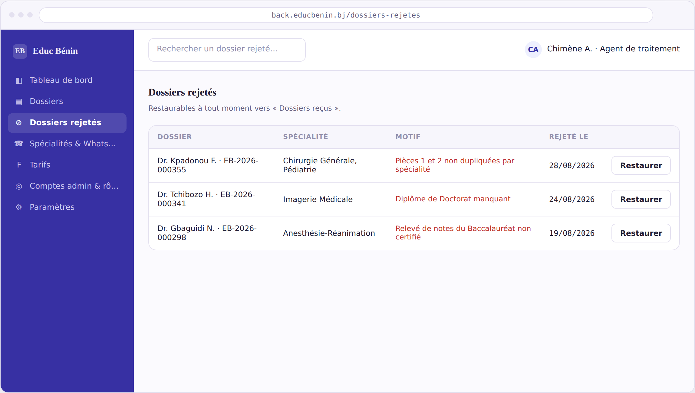
- 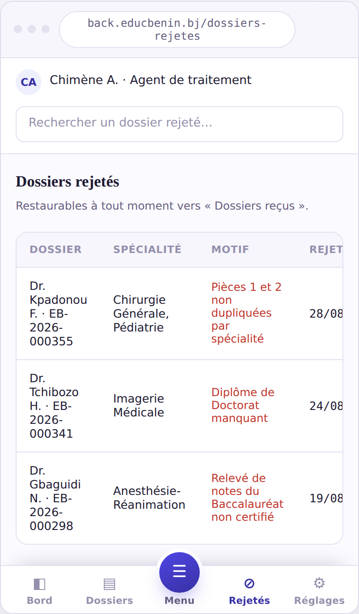

### Layout & visual design
- Titre "Dossiers rejetés" + sous-texte "Restaurables à tout moment vers « Dossiers reçus »."
- Table standard (`.tablewrap > table.dtable`) : colonnes Dossier, Spécialité, Motif, Rejeté le, (action). Colonne "Motif" en rouge (`.rej-reason`, couleur `--prod-danger`).

### Content — les 3 lignes d'exemple (statiques, indépendantes de `DOSSIERS`)
| Dossier | Spécialité | Motif | Rejeté le |
|---|---|---|---|
| Dr. Kpadonou F. · EB-2026-000355 | Chirurgie Générale, Pédiatrie | Pièces 1 et 2 non dupliquées par spécialité | 28/08/2026 |
| Dr. Tchibozo H. · EB-2026-000341 | Imagerie Médicale | Diplôme de Doctorat manquant | 24/08/2026 |
| Dr. Gbaguidi N. · EB-2026-000298 | Anesthésie-Réanimation | Relevé de notes du Baccalauréat non certifié | 19/08/2026 |

⚠️ **Remarque** : cette table est codée en dur dans le HTML (contrairement à la modale "Dossiers" qui lit le modèle JS `DOSSIERS`) — ces 3 lignes ne partagent aucune donnée avec les dossiers d1-d9 vus dans l'écran Dossiers, et le bouton "Restaurer" de chaque ligne **n'a pas de handler JS** (aucune action au clic dans le prototype — contrairement à la restauration disponible depuis la modale de l'écran Dossiers, qui elle est fonctionnelle). À unifier/rendre fonctionnel dans le produit réel.

### Functional behavior
Aucune logique interactive fonctionnelle dans le prototype (bouton "Restaurer" visuel uniquement, table statique).

### Responsive / mobile differences
Structure standard back-office mobile (barre latérale masquée, nav bottom, `min-width:520px` pour la table avec défilement horizontal interne si nécessaire).

---

## 12. Spécialités & WhatsApp (`specialites-admin`)

### Purpose
Administration des 27 fiches spécialité (date/heure/salle/lien WhatsApp dédié) et du lien WhatsApp général FSS propagé à toutes les fiches publiques.

### Screenshots
- 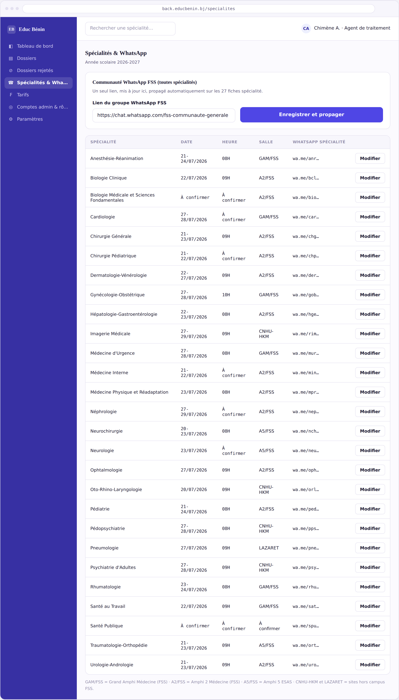
- 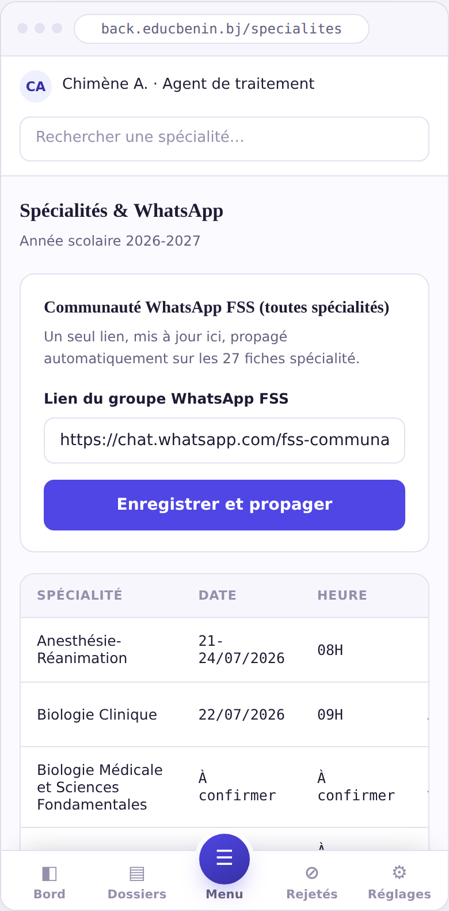

### Layout & visual design
- Titre "Spécialités & WhatsApp" + sous-texte "Année scolaire 2026-2027".
- Panneau "Communauté WhatsApp FSS (toutes spécialités)" — sous-texte "Un seul lien, mis à jour ici, propagé automatiquement sur les 27 fiches spécialité." — champ "Lien du groupe WhatsApp FSS" (valeur d'exemple `https://chat.whatsapp.com/fss-communaute-generale`) + bouton primaire "Enregistrer et propager" aligné en bas de ligne (`align-items:flex-end`, hauteur forcée 44px pour matcher le champ).
- Table (`#specAdminBody`) listant les **27 spécialités réelles** (même source `SPECIALTIES` que l'écran public "Spécialités" — plus de limitation à 8 lignes) : colonnes Spécialité, Date, Heure, Salle, "WhatsApp spécialité" (lien généré factice `wa.me/{code en minuscules}…`), bouton "Modifier" par ligne (sans handler).
- Même légende d'abréviations de salle qu'en public.

### Content
La table reproduit exactement les 27 lignes du tableau donné dans la section "Spécialités" (public) ci-dessus — nom, date, heure, salle identiques (source de données unique `SPECIALTIES`).

### Functional behavior
- Ni le bouton "Enregistrer et propager", ni les boutons "Modifier" par ligne n'ont de handler JS dans le prototype (purs éléments visuels).
- ⚠️ Pas de logique de propagation réelle observable — le nom du panneau ("propagé automatiquement sur les 27 fiches spécialité") décrit l'intention produit mais rien n'est implémenté dans ce fichier de démo (les 27 fiches publiques utilisent le même tableau `SPECIALTIES` en dur, donc dans le prototype la "propagation" est déjà vraie par construction du code, mais aucune vraie action d'édition/sauvegarde n'existe).

### Responsive / mobile differences
Structure standard back-office mobile ; le panneau "Communauté WhatsApp FSS" passe en `row2` 1 colonne.

---

## 13. Tarifs (`tarifs`)

### Purpose
Gestion du barème tarifaire (prix de base + règle multi-spécialités) avec historique des versions précédentes.

### Screenshots
- 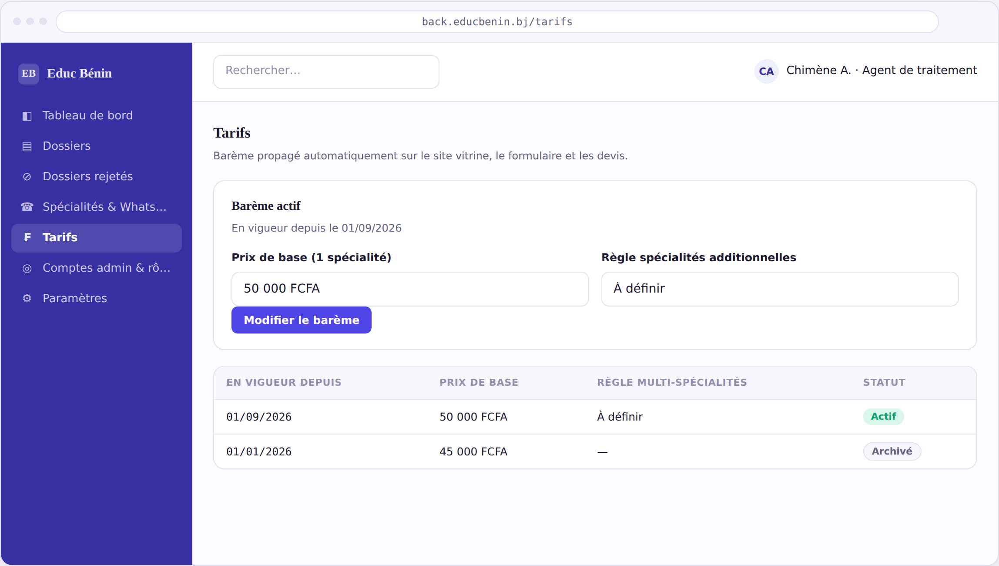
- 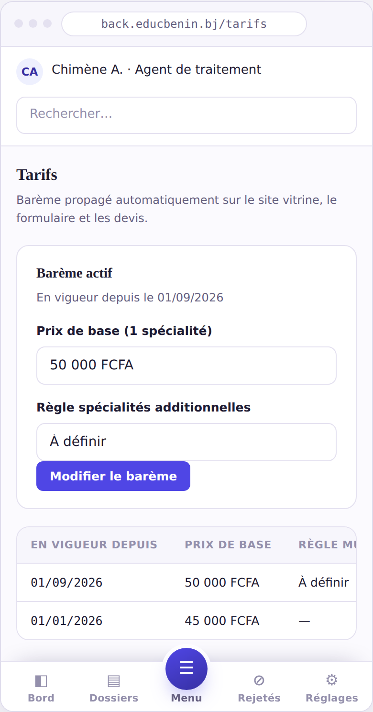

### Layout & visual design
- Titre "Tarifs" + sous-texte "Barème propagé automatiquement sur le site vitrine, le formulaire et les devis."
- Panneau "Barème actif" — sous-texte "En vigueur depuis le 01/09/2026" — deux champs côte à côte : "Prix de base (1 spécialité)" (valeur "50 000 FCFA") et "Règle spécialités additionnelles" (placeholder "ex. + 25 000 FCFA / spécialité supplémentaire", valeur actuelle "À définir") — bouton "Modifier le barème".
- Table d'historique : colonnes "En vigueur depuis", "Prix de base", "Règle multi-spécialités", "Statut" (pill "Actif" vert / "Archivé" neutre).

### Content — table d'historique (2 lignes)
| En vigueur depuis | Prix de base | Règle multi-spécialités | Statut |
|---|---|---|---|
| 01/09/2026 | 50 000 FCFA | À définir | Actif |
| 01/01/2026 | 45 000 FCFA | — | Archivé |

⚠️ **Point à noter pour le produit réel** : la "Règle spécialités additionnelles" / "Règle multi-spécialités" est explicitement marquée **"À définir"** dans les deux endroits où elle apparaît — le client n'a pas encore fixé de règle de tarification pour les demandes multi-spécialités (cohérent avec le callout d'accompagnement qui dit "Tarif multi-spécialités communiqué avant confirmation.", plutôt qu'un montant affiché automatiquement).

### Functional behavior
Aucune (bouton "Modifier le barème" sans handler ; table statique).

### Responsive / mobile differences
Structure standard back-office mobile ; `row2` du panneau passe à 1 colonne ; table avec `min-width:520px`.

---

## 14. Comptes admin & rôles (`comptes`)

### Purpose
Gestion des membres de l'équipe et de leurs permissions par module (5 modules).

### Screenshots
- 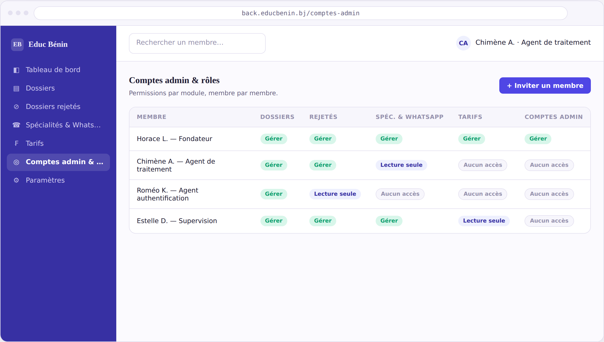
- 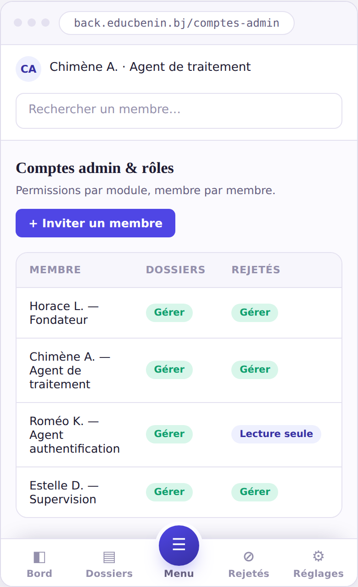

### Layout & visual design
- Titre "Comptes admin & rôles" + sous-texte "Permissions par module, membre par membre." + bouton primaire "+ Inviter un membre" aligné à droite du titre.
- Table (`#comptesBody`) : colonnes Membre, Dossiers, Rejetés, "Spéc. & WhatsApp", Tarifs, "Comptes admin" — chaque cellule de permission affichée en pastille colorée (`.perm`) : `manage` (vert, "Gérer"), `read` (indigo, "Lecture seule"), `none` (gris neutre, "Aucun accès").

### Content — les 4 membres d'exemple et leurs permissions (ordre des colonnes : Dossiers, Rejetés, Spéc. & WhatsApp, Tarifs, Comptes admin)
| Membre | Dossiers | Rejetés | Spéc. & WhatsApp | Tarifs | Comptes admin |
|---|---|---|---|---|---|
| Horace L. — Fondateur | Gérer | Gérer | Gérer | Gérer | Gérer |
| Chimène A. — Agent de traitement | Gérer | Gérer | Lecture seule | Aucun accès | Aucun accès |
| Roméo K. — Agent authentification | Gérer | Lecture seule | Aucun accès | Aucun accès | Aucun accès |
| Estelle D. — Supervision | Gérer | Gérer | Gérer | Lecture seule | Aucun accès |

### Functional behavior
Aucune (bouton "+ Inviter un membre" sans handler ; table de permissions en lecture seule dans le prototype, pas d'édition inline).

### Responsive / mobile differences
Structure standard back-office mobile ; table avec `min-width:520px` (défilement horizontal probable vu le nombre de colonnes en mobile).

---

## 15. Paramètres (`parametres`)

### Purpose
Gestion du profil personnel de l'utilisateur connecté (nom, e-mail, mot de passe) et déconnexion.

### Screenshots
- 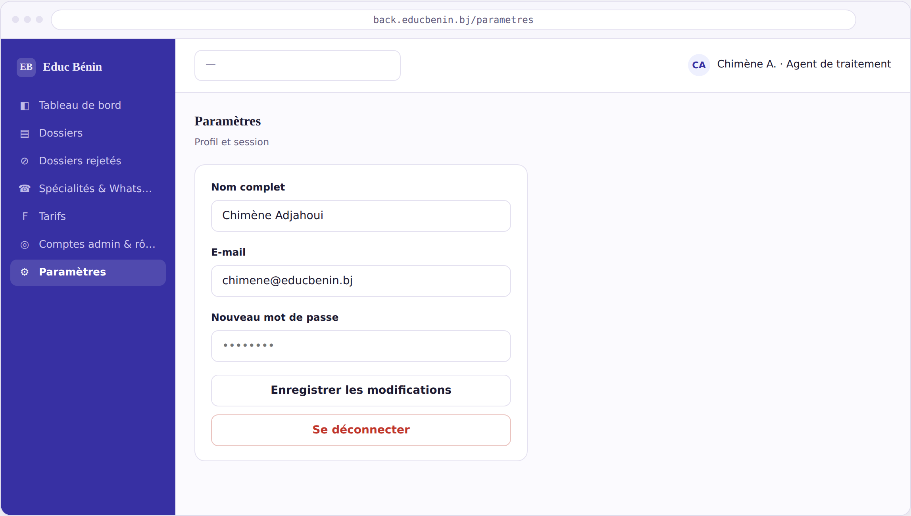
- 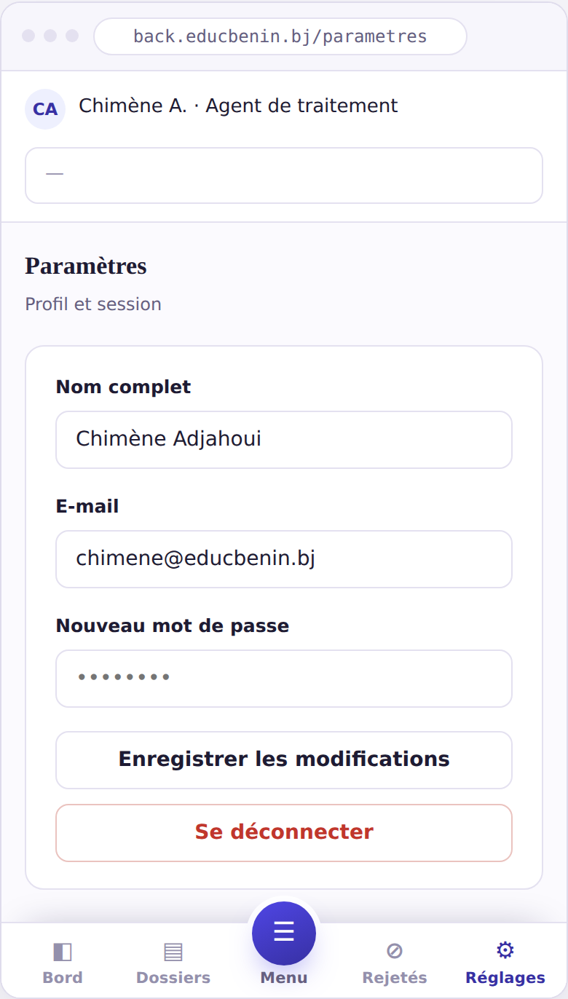

### Layout & visual design
- Titre "Paramètres" + sous-texte "Profil et session".
- Panneau unique (`max-width:420px`) : champ "Nom complet" (valeur "Chimène Adjahoui"), champ "E-mail" (valeur "chimene@educbenin.bj"), champ "Nouveau mot de passe" (vide, placeholder "••••••••"), bouton outline pleine largeur "Enregistrer les modifications", puis bouton danger-outline pleine largeur "Se déconnecter" (`data-goto="login"`).

### Content
Voir ci-dessus, valeurs exactes déjà citées. Barre de recherche `.bo-top` de cet écran spécifiquement affiche un tiret "—" au lieu d'un placeholder de recherche (seul écran back-office où la recherche est désactivée/non pertinente).

### Functional behavior
- "Enregistrer les modifications" : aucun handler (bouton visuel).
- "Se déconnecter" : navigue simplement vers l'écran Connexion (`showScreen('login')`) — pas de vraie invalidation de session dans le prototype, logique attendue côté produit réel.

### Responsive / mobile differences
Structure standard back-office mobile ; le panneau conserve son `max-width:420px` mais s'adapte à la largeur du cadre mobile (390px), donc occupe en pratique toute la largeur disponible.

---

## Récapitulatif des points à trancher / vérifier avant implémentation

1. **Validation de formulaire (Accompagnement)** : aucune règle de validation (champs requis, format du numéro WhatsApp, taille/format du fichier PDF) n'est implémentée dans le prototype — à spécifier.
2. **Réinitialisation du formulaire de demande** : dans le prototype, revenir sur l'écran Accompagnement après soumission laisse l'écran de confirmation affiché au lieu de réafficher l'étape 1 (état géré en `style.display` direct, non réinitialisé par la navigation) — comportement à corriger pour le produit réel.
3. **Recherche "Suivre mon dossier"** : le champ de recherche réel (référence + WhatsApp) n'est pas câblé dans le prototype ; seul le sélecteur de démonstration `#trackPick` pilote l'affichage. La fonction `renderTimeline(stage)` est réutilisable telle quelle comme moteur de rendu une fois la vraie recherche branchée.
4. ~~État "formulaire d'authentification jamais envoyé" non illustré~~ — **résolu** : le dossier d10 (Dr. Agbodji Firmin) a été ajouté aux données d'exemple spécifiquement pour ce cas ; les 3 états du bouton d'authentification sont maintenant tous démontrables sans artifice.
5. **Bouton "Récépissé"** (ajouter/voir) : pas de handler de clic implémenté (ni upload, ni aperçu) — à concevoir intégralement.
6. **Bouton "Modifier"** (modale dossier) : présent, toujours actif, mais sans action de clic ni formulaire d'édition associé dans le prototype — à concevoir.
7. **Motif de rejet** : le texte saisi dans le champ de motif au moment du rejet n'est jamais effectivement stocké/relié au dossier dans le prototype — à persister réellement (et à afficher ensuite dans la colonne "Motif" de l'écran Dossiers rejetés).
8. **Écran "Dossiers rejetés"** : table statique indépendante du modèle `DOSSIERS`, bouton "Restaurer" sans handler — à unifier avec le modèle de données réel et la fonction de restauration déjà fonctionnelle dans la modale de l'écran Dossiers.
9. **Règle tarifaire multi-spécialités** : explicitement "À définir" à deux endroits (Tarifs, historique) — le client n'a pas encore fixé de montant/formule pour les dossiers portant sur plusieurs spécialités.
10. **Mentions légales / Politique de confidentialité** : plusieurs champs juridiques sont des placeholders "[À COMPLÉTER]" (raison sociale, RCCM, IFU, siège, contact, responsable de traitement, hébergeur) — non finalisés côté client, à ne pas inventer.
11. **Durée de conservation des données** (Politique de confidentialité) : "24 mois après clôture" est explicitement qualifié de "(proposition à valider)" dans le texte source.
12. **CGU/CGV** : numérotation des articles lacunaire (1, 2, 3, 5, 6, 8, 10 — pas 4, 7, 9) dans le prototype ; probablement un contenu volontairement incomplet à ce stade, à confirmer avec le client avant rédaction finale.
13. **`.p-burger`** (icône hamburger à côté du logo public) : toujours `display:none` par CSS, sur les deux modes — élément mort du markup, à ne pas reproduire comme fonctionnel.
14. **Incohérence mineure de nom** : `.bo-user` affiche partout "Chimène A. · Agent de traitement" alors que le formulaire Paramètres affiche le nom complet "Chimène Adjahoui" — même personne, présentations différentes, cohérence à assurer dans le produit réel.
15. **Boutons WhatsApp** (fiche spécialité publique, `.wa-btn`) : pas de véritable lien `wa.me/...` câblé dans le prototype — placeholders visuels.
16. **Bouton Google (connexion)** : purement visuel, aucune intégration OAuth réelle ; navigue directement vers le tableau de bord comme le bouton "Se connecter" classique, sans aucune vérification.
17. **Comptes admin & rôles** : table de permissions en lecture seule dans le prototype (pas de contrôle d'édition inline visible) — l'interaction d'édition reste à concevoir.

---

## Note de méthode — captures d'écran

Les 57 captures ont été produites avec Playwright (Chromium headless), en chargeant le fichier `educbenin-prototype.html` en `file://` avec **tout appel réseau sortant bloqué** (seules les requêtes `file://` sont autorisées ; tout le reste — Google Fonts, Chart.js CDN, bouton Google, etc. — est intercepté et annulé), afin d'éviter toute requête réseau réelle et de garantir un rendu déterministe. Chaque capture correspond à l'élément `#frame` uniquement (le cadre de prototype, sans le chrome de l'outil autour), en `device_scale_factor:2` pour une bonne lisibilité. Pour certains scénarios (formulaire de demande après soumission, dossiers avec états mutés), la page a été **rechargée** entre les séquences afin de repartir d'un état JS propre et documenté (le prototype gère certains états via `style.display` direct plutôt que via des classes, ce qui ne se réinitialise pas automatiquement à la navigation interne — voir point 2 du récapitulatif ci-dessus). Un seul état a nécessité une intervention hors-DOM (voir point 4 du récapitulatif) : exposer temporairement l'objet `DOSSIERS` sur `window` via une requête HTML interceptée et légèrement modifiée en mémoire (le fichier source sur disque n'a jamais été modifié), pour forcer `authSent:false` sur un dossier d'étape 2 et illustrer l'état "formulaire jamais envoyé" qu'aucune donnée d'exemple native ne couvre.
